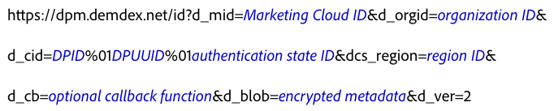

# Experience Cloud Identity Service との直接統合 {#direct-integration-with-the-experience-cloud-id-service}

この実装により、お客様はJavaScriptまたはSDKコードを受け入れたり、使用したりできないデバイスでIDサービスを使用できます。 ゲーム機、スマートTV、その他のインターネット対応アプライアンスなどのデバイスが含まれます。 構文、コードサンプルおよび定義については、この節を参照してください。

## 構文{#section-a4754afec5ad40b6be00d6f1011d68bb}

VisitorAPI.js または SDK コードライブラリを使用できないデバイスは、ID サービスで使用されるデータ収集サーバー（DCS）を直接呼び出すことができます。これをおこなうには `dpm.demdex.net` を呼び出し、次の形式のリクエストを使用します。*斜体*&#x200B;の部分には実際の情報が入ります。



この構文の例において、`d_` というプレフィックスは呼び出し内のキーと値のペアがシステムレベルの変数であることを示します。ID サービスには多くの `d_` パラメーターを渡すことができますが、上のコードに示されているキーと値のペアに特に注目してください。For more information about other variables, see [Supported Attributes for DCS API calls](https://docs.adobe.com/content/help/en/audience-manager/user-guide/api-and-sdk-code/dcs/dcs-api-reference/dcs-keys.html).

IDサービスは、HTTP呼び出しとHTTPS呼び出しをサポートします。 HTTPSを使用して、セキュリティで保護されたページからデータを渡します。

## リクエストのサンプル {#section-26302b8851704888b6f8e6b2071bcdb0}

リクエストは、以下に示すサンプルのようになります。 長い変数が短縮されました。


## レスポンスのサンプル {#section-89bc103b3e9e4a8b98e74c32897b1200}

以下に示すように、IDサービスはJSONオブジェクトでデータを返します。 回答が異なる場合があります。

```js
{
     "d_mid":"12345",
     "dcs_region":"6",
     "id_sync_ttl":"604800",
     "d_blob":"wxyz5432"
}
```

## リクエストパラメーターおよびレスポンスパラメーターの定義 {#section-4a9912b545364dc4acad4f1ea5ec641d}

**リクエストパラメーター**

<table id="table_C8FFA89AB74E4E31A6926CDE5CD54217"> 
 <thead> 
  <tr> 
   <th colname="col1" class="entry"> パラメーター </th> 
   <th colname="col2" class="entry"> 説明 </th> 
  </tr> 
 </thead>
 <tbody> 
  <tr> 
   <td colname="col1"> <p> <span class="codeph"> dpm.demdex.net</span> </p> </td> 
   <td colname="col2"> <p><span class="keyword">アドビ</span>が管理する従来のドメインです。<a href="https://docs.adobe.com/content/help/ja-JP/audience-manager/user-guide/reference/demdex-calls.html" format="https" scope="external">Demdex ドメインの呼び出しについて</a>を参照してください。 </p> </td> 
  </tr> 
  <tr> 
   <td colname="col1"> <p> <span class="codeph"> d_mid</span> </p> </td> 
   <td colname="col2"> <p>Experience Cloud訪問者ID。 See <a href="../introduction/cookies.md" format="dita" scope="local"> Cookies and the Experience Cloud Identity Service</a>. </p> </td> 
  </tr> 
  <tr> 
   <td colname="col1"> <p> <span class="codeph"> d_orgid</span> </p> </td> 
   <td colname="col2"> <p>Experience Cloud組織ID。 このIDの検索方法については、Experience Cloud IDサービスの <a href="../reference/requirements.md" format="dita" scope="local"> 要件を参照してください</a>。 </p> </td> 
  </tr> 
  <tr> 
   <td colname="col1"> <p> <span class="codeph"> d_cid</span> </p> </td> 
   <td colname="col2"> <p>データプロバイダー ID（DPID）、一意のユーザー ID（DPUUID）および<a href="../reference/authenticated-state.md" format="dita" scope="local">認証済み状態 ID </a>を ID サービスに渡すオプションのパラメーター。コードサンプルで示すように、DPID と DPUUID の間は非表示の制御文字 <span class="codeph">%01</span> で区切ります。 </p> <p> <b>DPID および DPUUID</b> </p> <p><span class="codeph">d_cid</span> パラメーターでは、関連する DPID と DPUUID の各組み合わせを同じ <span class="codeph">d_cid</span> パラメーターに割り当てます。これにより、複数の ID セットを単一のリクエストで設定できます。また、DPID、DPUUID、および任意の認証フラグの間は非表示の制御文字 <span class="codeph">%01</span> で区切ります。以下の例では、プロバイダー ID とユーザー ID が<b>太字</b>のテキストで強調されています。 </p> 
    <ul id="ul_2E19D837296B40E9ACD096495CF711C5"> 
     <li id="li_5B94B057654440B99B989BA60E4ED053">構文：<span class="codeph">...d_cid=DPID%01DPUUID%01認証状態...</span> </li> 
     <li id="li_B07833EF51D54F088574B7B7F9FB841A">例：<span class="codeph">...d_cid=123%01456%011...</span> </li> 
    </ul> <p> <b>認証状態</b> </p> <p>これは <span class="codeph">d_cid</span> パラメーターのオプションの ID です。整数で表され、以下に示す認証状態によってユーザーを識別します。 </p> 
    <ul id="ul_E2B36922B11C4AA2A9016B6E2DC9EDAA"> 
     <li id="li_31C018E3F9514B938C73EF40C436715F"> <span class="codeph">0</span>（不明） </li> 
     <li id="li_1F125C3879324C2F8EF4613C0ECB5F02"> <span class="codeph">1</span>（認証済み） </li> 
     <li id="li_EF6792D0115D407485079D5D7480D965"> <span class="codeph">2</span>（ログアウト済み） </li> 
    </ul> <p>認証状態を指定するには、ユーザー ID（UUID）変数の後にこのフラグを設定します。また、UUID と任意の認証フラグの間は非表示の制御文字 <span class="codeph">%01</span> で区切ります。以下の例では、認証 ID が<b>太字</b>のテキストで強調されています。 </p> <p>構文：<span class="codeph">...d_cid=DPID%01DPUUID%01認証状態</span> </p> <p>例： </p> 
    <ul id="ul_4C1054CE860A4D9C8DD85C2A8020C47F"> 
     <li id="li_AD4000BF3E0146C0BD37B1EC513EC314">不明：<span class="codeph">...d_cid=123%01456%010...</span> </li> 
     <li id="li_B037D424AADA4D41BF29381A9602AE61">認証済み：<span class="codeph">...d_cid=123%01456%011...</span> </li> 
     <li id="li_0410FCB9E60D4DD08E7898D814E1C3C9">ログアウト済み：<span class="codeph">...d_cid=123%01456%012...</span> </li> 
    </ul> </td> 
  </tr> 
  <tr> 
   <td colname="col1"> <p> <span class="codeph"> dcs_region</span> </p> </td> 
   <td colname="col2"> <p>IDサービスは、地理的に分散され、負荷分散が行われるシステムです。 IDは、呼び出しを処理するデータセンターの領域を識別します。 <a href="https://docs.adobe.com/content/help/en/audience-manager/user-guide/api-and-sdk-code/dcs/dcs-api-reference/dcs-regions.html" format="https" scope="external">DCS 地域 ID、場所、ホスト名</a>を参照してください。 </p> </td> 
  </tr> 
  <tr> 
   <td colname="col1"> <p> <span class="codeph"> d_cb</span> </p> </td> 
   <td colname="col2"> <p> <i>（オプション）</i>リクエスト本文で JavaScript 関数を実行できるようにするコールバックパラメーターです。 </p> </td> 
  </tr> 
  <tr> 
   <td colname="col1"> <p> <span class="codeph"> d_blob</span> </p> </td> 
   <td colname="col2"> <p>JavaScriptメタデータの暗号化されたチャンクです。 サイズ制約により、blobは512バイト以下に制限されます。 </p> </td> 
  </tr> 
  <tr> 
   <td colname="col1"> <p> <span class="codeph"> d_ver</span> </p> </td> 
   <td colname="col2"> <p>必須. APIのバージョン番号を設定します。 この設定は <span class="codeph">d_ver=2</span> のままにしてください。 </p> </td> 
  </tr> 
 </tbody> 
</table>

**応答パラメーター**

一部の応答パラメーターはリクエストの一部であり、上の節で定義されています。

<table id="table_58D0E8876DDC4A81B1F24F845E87EC18"> 
 <thead> 
  <tr> 
   <th colname="col1" class="entry"> パラメーター </th> 
   <th colname="col2" class="entry"> 説明 </th> 
  </tr> 
 </thead>
 <tbody> 
  <tr> 
   <td colname="col1"> <p> <span class="codeph"> id_sync_ttl</span> </p> </td> 
   <td colname="col2"> <p>再同期間隔（秒単位）。 デフォルトの間隔は604,800秒（7日間）です。 </p> </td> 
  </tr> 
 </tbody> 
</table>

