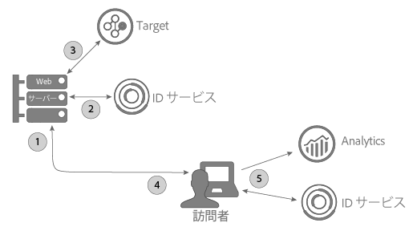

# A4TおよびTargetのサーバーサイド実装での訪問者ID サービスの使用 {#using-the-id-service-with-a-t-and-a-server-side-implementation-of-target}

これらの手順は、Target、Analytics、および訪問者ID サービスのサーバーサイドとクライアントサイドの両方の実装を持つA4Tのお客様向けです。 NodeJSまたはRhino環境で訪問者ID サービスを実行する必要があるお客様も、この情報を確認する必要があります。 訪問者ID サービスのこのインスタンスでは、Node Package Manager （NPM）からダウンロードしてインストールする短縮バージョンの`VisitorAPI.js` コードライブラリを使用します。 インストール手順およびその他の設定要件については、この節を参照してください。

## はじめに {#section-ab0521ff5bbd44c592c3eaab31c1de8b}

A4T （およびその他のお客様）は、必要に応じて、このバージョンの訪問者ID サービスを使用できます。

* web ページコンテンツをサーバー上でレンダリングして最終表示用にブラウザーに渡す。
* サーバーサイドのTarget呼び出しを行います。
* Analyticsへのクライアントサイド（ブラウザー内）呼び出しを行います。
* Target IDとAnalytics IDを別々に同期して、一方のソリューションで表示された訪問者が、もう一方のソリューションで表示された訪問者と同じ人物かどうかを判断します。

## コードのダウンロードと提供されたインターフェイス {#section-32d75561438b4c3dba8861be6557be8a}

[訪問者ID サービス NPM リポジトリ ](https://www.npmjs.com/package/@adobe-mcid/visitor-js-server)を参照して、サーバーサイド コードパッケージをダウンロードし、現在のビルドに含まれるインターフェイスを確認します。

## ワークフロー {#section-56b01017922046ed96536404239a272b}

以下の図と節では、サーバーサイド実装プロセスの各手順で何が行われ、何を設定する必要があるかを説明します。



## 手順 1：リクエストページ {#section-c12e82633bc94e8b8a65747115d0dda8}

web ページを読み込む HTTP リクエストを訪問者が実行すると、サーバーサイドアクティビティが開始します。 このステップで、サーバーはこのリクエストを受け取り、[AMCV cookie](../introduction/cookies.md) をチェックします。 AMCV Cookieには、訪問者のECIDが含まれます。

## 手順2：訪問者ID サービスペイロードの生成 {#section-c86531863db24bd9a5b761c1a2e0d964}

次に、訪問者ID サービスにサーバーサイド *`payload request`*&#x200B;を作成する必要があります。 ペイロードリクエストは以下を行います。

* AMCV Cookieを訪問者ID サービスに渡します。
* 以下に説明する後続の手順で Target と Analytics で必要になるデータをリクエストします。

>[!NOTE]
>
>このメソッドは、Targetから1つのmboxをリクエストします。 1 回の呼び出しで複数の mbox をリクエストする必要がある場合は、[generateBatchPayload](https://www.npmjs.com/package/@adobe-mcid/visitor-js-server#generatebatchpayload) を参照してください。

ペイロードリクエストは、以下のコードサンプルのようになります。 このコードサンプルでは、`visitor.setCustomerIDs` 関数はオプションです。 詳しくは、[顧客 ID および認証の状態](../reference/authenticated-state.md)を参照してください。

```js
//Import the Visitor ID Service server package 
var Visitor = require("@adobe-mcid/visitor-js-server"); 
 
//Pass in your IMS org ID to instantiate Visitor 
var visitor = new Visitor("Insert ECID here"); 
 
// 
<i>(Optional)</i> Set a custom customer ID 
visitor.setCustomerIDs({ 
     userid:{ 
          id:"1234", 
          authState: Visitor.AuthState.UNKNOWN //AuthState is a static property of the Visitor class 
     } 
}); 
 
//Parse the visitor's HTTP request for the AMCV cookie 
var cookies = cookie.parse(req.headers.cookie || ""); 
var cookieName = visitor.getCookieName(); // Visitor API that returns the cookie name. 
var amcvCookie = cookies[cookieName]; 
 
//Generate the payload request pass your mbox name and the AMCV cookie if present 
var visitorPayload = visitor.generatePayload({ 
     mboxName: "bottom-banner-mbox", 
     amcvCookie: amcvCookie 
});
```

訪問者ID サービスは、次の例のように、JSON オブジェクト内のペイロードを返します。 ペイロードデータはTargetに必要です。

```js
{ 
    "marketingCloudVisitorId": "02111696918527575543455026275721941645", 
    "mboxParameters": { 
        "mboxAAMB": "abcd1234", 
        "mboxMCGLH": "9", 
        "mboxMCSDID": "56BE026543F7E211-1CC51BCAAE88F0D2", 
        "vst.userid.id": "1234567890", 
        "vst.userid.authState": 0 
    } 
}
```

訪問者が AMCV Cookie を持っていない場合、ペイロードは、これらのキーと値のペアを省略します。

* `marketingCloudvisitorId`
* `mboxAAMB`
* `mboxMCGLH`

## 手順 3：Target 呼び出しへのペイロードの追加 {#section-62451aa70d2f44ceb9fd0dc2d4f780f7}

サーバーが訪問者ID サービスからペイロードデータを受信したら、追加のコードをインスタンス化して、Targetに渡されたデータと結合する必要があります。 Targetに渡される最終的なJSON オブジェクトは、次のようになります。

```js
{ 
"mbox" : "target-global-mbox", 
"marketingCloudVisitorId":"02111696918527575543455026275721941645", 
"requestLocation" : { 
     "pageURL" : "http://www.domain.com/test/demo.html", 
     "host" : "localhost:3000" 
     }, 
"mboxParameters" : { 
     "mboxAAMB" : "abcd1234", 
     "mboxMCGLH" : "9", 
     "mboxMCSDID": "56BE026543F7E211-1CC51BCAAE88F0D2", 
     "vst.userid.id": "1234567890", 
     "vst.userid.authState": 0, 
     } 
} 
```

## 手順4：訪問者ID サービスのサーバー状態を取得する {#section-8ebfd177d42941c1893bfdde6e514280}

サーバー状態データには、サーバー上で行われた作業に関する情報が含まれています。 クライアントサイドの訪問者ID サービスコードには、この情報が必要です。 非標準プロセスを通じて訪問者ID サービスを設定した場合は、独自のコードでサーバー状態を返す必要があります。 クライアントサイドのVisitor ID サービスとAnalytics コードは、ページの読み込み時にステートデータをAdobeに渡します。

訪問者ID サービスの非標準の実装がある場合は、このコードをサーバー上で実行するように設定し、要求されたページを組み立てる必要があります。

```js
//Get server state 
var serverState = visitor.getState(); 
 
Response.send(" 
... 
<head> 
     <script src="VisitorAPI.js"></script> 
     <script> 
          var visitor = Visitor.getInstance(orgID, { 
          serverState: serverState  
          ... 
     </script> 
</head> 
...
```

## ステップ 5：ページの提供とCX企業データの返却 {#section-4b5631a0d75a41febd6f43f8c214c263}

この時点で、Web サーバーは訪問者のブラウザーにページコンテンツを送信します。 この時点から、ブラウザー（サーバーではなく）は、残りのすべての訪問者ID サービスとAnalytics呼び出しを行います。 例えば、ブラウザーでは次のようになります。

* 訪問者ID サービスは、サーバーから状態データを受け取り、SDIDをAppMeasurementに渡します。
* AppMeasurementは、SDIDを含むAnalyticsにページヒットに関するデータを送信します。
* AnalyticsとTargetは、この訪問者のSDIDを比較します。 同じSDIDを使用すると、TargetとAnalyticsはサーバーサイドコールとクライアントサイドコールをつなぎ合わせます。 この時点で、両方のソリューションは、この訪問者を同じ人物として認識します。

>[!MORELIKETHIS]
>
>* [ ノードパッケージマネージャー](https://www.npmjs.com/package/@adobe-mcid/visitor-js-server)のサーバーサイド訪問者ID サービスパッケージ

