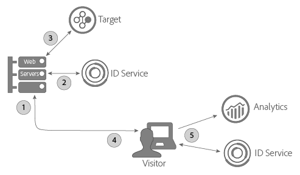

# Target のサーバー側実装を使用する A4T での ID サービスの使用 {#using-the-id-service-with-a-t-and-a-server-side-implementation-of-target}

これらの手順は、ターゲット、Analytics、IDサービスのサーバー側とクライアント側の実装を混在させるA4Tのお客様向けです。 NodeJSまたはRhino環境でIDサービスを実行する必要があるお客様も、この情報を確認する必要があります。 IDサービスのこのインスタンスは、Node Package Manager(NPM)からダウンロードしてインストールできる、短縮版のVisitorAPI.jsコードライブラリを使用します。 インストール手順およびその他の設定要件については、この節を参照してください。

## はじめに {#section-ab0521ff5bbd44c592c3eaab31c1de8b}

A4T（および他のお客様）は、以下が必要な場合に、このバージョンのIDサービスを使用できます。

* サーバーでWebページコンテンツをレンダリングし、最終表示用にブラウザーに渡します。
* サーバー側 [!DNL Target] 呼び出しをおこなう。
* [!DNL Analytics] に対するクライアント側（ブラウザー内）呼び出しをおこなう。
* 個別の [!DNL Target] および [!DNL Analytics] ID を同期して、あるソリューションで見られた訪問者が他のソリューションで見られた人物と同じかどうかを判定する。

## コードのダウンロードと提供されたインターフェイス {#section-32d75561438b4c3dba8861be6557be8a}

サーバー側コードパッケージをダウンロードして、現在のビルドに含まれるインターフェイスを確認するには、[ID サービス NPM リポジトリ](https://www.npmjs.com/package/@adobe-mcid/visitor-js-server)を参照してください。

## ワークフロー {#section-56b01017922046ed96536404239a272b}

以下の図と節では、サーバー側実装プロセスの各手順で発生することと、設定する必要があることを説明します。



## 手順 1：ページのリクエスト {#section-c12e82633bc94e8b8a65747115d0dda8}

訪問者がWebページの読み込みをHTTPリクエストすると、サーバー側のアクティビティが開始します。 この手順中、サーバーはこのリクエストを受け取り、[AMCV cookie](../introduction/cookies.md)をチェックします。 AMCV Cookie には、訪問者の [!DNL Experience Cloud] ID（MID）が含まれます。

## 手順 2：ID サービスペイロードの生成 {#section-c86531863db24bd9a5b761c1a2e0d964}

次に、サーバー側 *`payload request`* を ID サービスにする必要があります。ペイロードリクエスト：

* AMCV cookieをIDサービスに渡します。
* 以下に説明する後続の手順で、ターゲットおよびAnalyticsで必要なデータをリクエストします。

>[!NOTE]
>
>このメソッドは、[!DNL Target] から 1 つの mbox をリクエストします。1回の呼び出しで複数のmboxをリクエストする必要がある場合は、[generateBatchPayload](https://www.npmjs.com/package/@adobe-mcid/visitor-js-server#generatebatchpayload)を参照してください。

ペイロードリクエストは、以下のコードサンプルのようになります。このコードサンプルでは、`visitor.setCustomerIDs` 関数はオプションです。詳しくは、[顧客 ID および認証の状態](../reference/authenticated-state.md)を参照してください。

```js
//Import the ID service server package 
var Visitor = require("@adobe-mcid/visitor-js-server"); 
 
//Pass in your Organization ID to instantiate Visitor 
var visitor = new Visitor("Insert Experience Cloud ID here"); 
 
// 
<i>(Optional)</i> Set a custom customer ID 
visitor.setCustomerIDs({ 
     userid:{ 
          id:"1234", 
          authState: Visitor.AuthState.UNKNOWN //AuthState is a static property of the Visitor class 
     } 
}); 
 
//Parse the visitor's HTTP request for the AMCV cookie 
var cookies = cookie.parse(req.headers.cookie || ""); 
var cookieName = visitor.getCookieName(); // Visitor API that returns the cookie name. 
var amcvCookie = cookies[cookieName]; 
 
//Generate the payload request pass your mbox name and the AMCV cookie if present 
var visitorPayload = visitor.generatePayload({ 
     mboxName: "bottom-banner-mbox", 
     amcvCookie: amcvCookie 
});
```

ID サービスは、以下の例のように、JSON オブジェクトでペイロードを返します。ペイロードデータは、[!DNL Target] で必要です。

```js
{ 
    "marketingCloudVisitorId": "02111696918527575543455026275721941645", 
    "mboxParameters": { 
        "mboxAAMB": "abcd1234", 
        "mboxMCGLH": "9", 
        "mboxMCSDID": "56BE026543F7E211-1CC51BCAAE88F0D2", 
        "vst.userid.id": "1234567890", 
        "vst.userid.authState": 0 
    } 
}
```

訪問者が AMCV Cookie を持っていない場合、ペイロードは、これらのキーと値のペアを省略します。

* `marketingCloudvisitorId`
* `mboxAAMB`
* `mboxMCGLH`

## 手順3：ペイロードの Target 呼び出しへの追加 {#section-62451aa70d2f44ceb9fd0dc2d4f780f7}

サーバーが ID サービスからペイロードデータを受け取ったら、追加のコードをインスタンス化して、[!DNL Target] に渡したデータと結合する必要があります。[!DNL Target] に渡された最終的な JSON オブジェクトは、以下のようになります。

```js
{ 
"mbox" : "target-global-mbox", 
"marketingCloudVisitorId":"02111696918527575543455026275721941645", 
"requestLocation" : { 
     "pageURL" : "http://www.domain.com/test/demo.html", 
     "host" : "localhost:3000" 
     }, 
"mboxParameters" : { 
     "mboxAAMB" : "abcd1234", 
     "mboxMCGLH" : "9", 
     "mboxMCSDID": "56BE026543F7E211-1CC51BCAAE88F0D2", 
     "vst.userid.id": "1234567890", 
     "vst.userid.authState": 0, 
     } 
} 
```

## 手順 4：ID サービスのサーバー状態の取得 {#section-8ebfd177d42941c1893bfdde6e514280}

サーバー状態データには、サーバー上で行われた作業に関する情報が含まれます。 クライアント側IDサービスコードには、この情報が必要です。 [!DNL Dynamic Tag Manager]（DTM）を使用して ID サービスを実装したお客様は、このツールを使用してサーバー状態データを渡すように DTM を設定できます。非標準のプロセスで ID サービスを設定した場合、独自のコードを使用してサーバー状態を返す必要があります。クライアント側 ID サービスおよび [!DNL Analytics] コードは、ページが読み込まれる際に Adobe に状態データを渡します。

**DTM を使用したサーバー状態の取得**

DTM を使用して ID サービスを実装した場合、ページにコードを追加して、DTM 設定に名前と値のペアを指定する必要があります。

**ページコード**

このコードを HTML ページの `<head>` タグに追加します。

```js
//Get server state 
var serverState = visitor.getState(); 
 
Response.send(" 
... 
<head> 
     <script> 
          //Add 'serverState' as a stringified JSON global variable. 
          "var serverState = "+ JSON.stringify(serverState) +";  
     </script> 
     <script src = "DTM script (satellite JS)"> 
     </script> 
</head> 
...
```

**DTM 設定**

これらを名前と値のペアとして ID サービスインスタンスの&#x200B;**[!UICONTROL 一般／設定]**&#x200B;セクションに追加します。

* **[!UICONTROL 名前：]** serverState
* **[!UICONTROL 値：]**%serverState%

   >[!IMPORTANT]
   >
   >値の名前は、ページコードの `serverState` に設定した変数名に一致する必要があります。

設定は次のようになります。


「[DTM](../implementation-guides/standard.md#concept-fb6cb6a0e6cc4f10b92371f8671f6b59)のExperience CloudIDサービスの設定」も参照してください。

**DTM を使用しないサーバー状態の取得**

ID サービスの非標準の実装をおこなった場合、このコードを設定して、リクエストされたページのアセンブル中に、サーバー上で実行する必要があります。

```js
//Get server state 
var serverState = visitor.getState(); 
 
Response.send(" 
... 
<head> 
     <script src="VisitorAPI.js"></script> 
     <script> 
          var visitor = Visitor.getInstance(orgID, { 
          serverState: serverState  
          ... 
     </script> 
</head> 
...
```

## 手順 5：ページを提供して Experience Cloud データを返す {#section-4b5631a0d75a41febd6f43f8c214c263}

この時点で、Web サーバーは訪問者のブラウザーにページコンテンツを送信します。これ以降、（サーバーではなく）ブラウザーが残りのすべての ID サービスおよび [!DNL Analytics] の呼び出しをおこないます。例えば、ブラウザーでは次のようになります。

* IDサービスは、サーバーから状態データを受け取り、SDIDをAppMeasurementに渡します。
* AppMeasurement が、SDID を含むページヒットに関するデータを [!DNL Analytics] に送信します。
* [!DNL Analytics] および [!DNL Target] は、この訪問者の SDID を比較します。同一の SDID の場合、[!DNL Target] および [!DNL Analytics] は、サーバー側呼び出しとクライアント側呼び出しを共に結合します。この時点で、両方のソリューションは、この訪問者を同じ人物として認識します。

>[!MORELIKETHIS]
>
>* [Node Package Manager によるサーバー側 ID サービスパッケージ](https://www.npmjs.com/package/@adobe-mcid/visitor-js-server)

