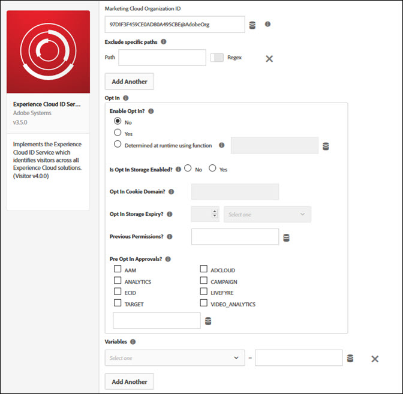

# Experience Platform Launch を使用したオプトインの設定 {#configuring-opt-in-with-launch}

Adobe Experience Platform Launch を使用したオプトイン用の Experience Cloud ソリューションの有効化を簡略化します。

## Experience Platform Launch を使用したオプトインシナリオの設定 {#section-8aa1b58bf8374c938aa8cfdeddbad6ff}

[Adobe Experience Platform Launch](https://experienceleague.adobe.com/docs/experience-platform/tags/home.html?lang=ja) を使用すると、アドビソリューションでオプトインシナリオを簡単に設定できます。 Analytics、Target、Audience Manager、他のまたは選択されたすべての Experience Cloud ソリューションが同意管理システムにオプトインできるようにすることで、Experience Cloud ソリューションの訪問者オプトイン同意の収集を簡素化できます。

**Experience Cloud ID 拡張機能の設定**

Experience Cloud ID 拡張がまだインストールされていない場合は、プロパティを開き、*拡張機能*／*カタログ*&#x200B;の順にクリックして、Experience Cloud ID 拡張にカーソルを置いて「*インストール*」をクリックします。

拡張機能を設定するには、「*拡張機能*」タブを開き、拡張機能の上にカーソルを置きます。 次に、「*設定*」をクリックします。

その他の参照情報については、[Adobe Experience Cloud ID サービス拡張機能の概要](https://experienceleague.adobe.com/docs/experience-platform/tags/extensions/client/id-service/overview.html?lang=ja)を参照してください。

