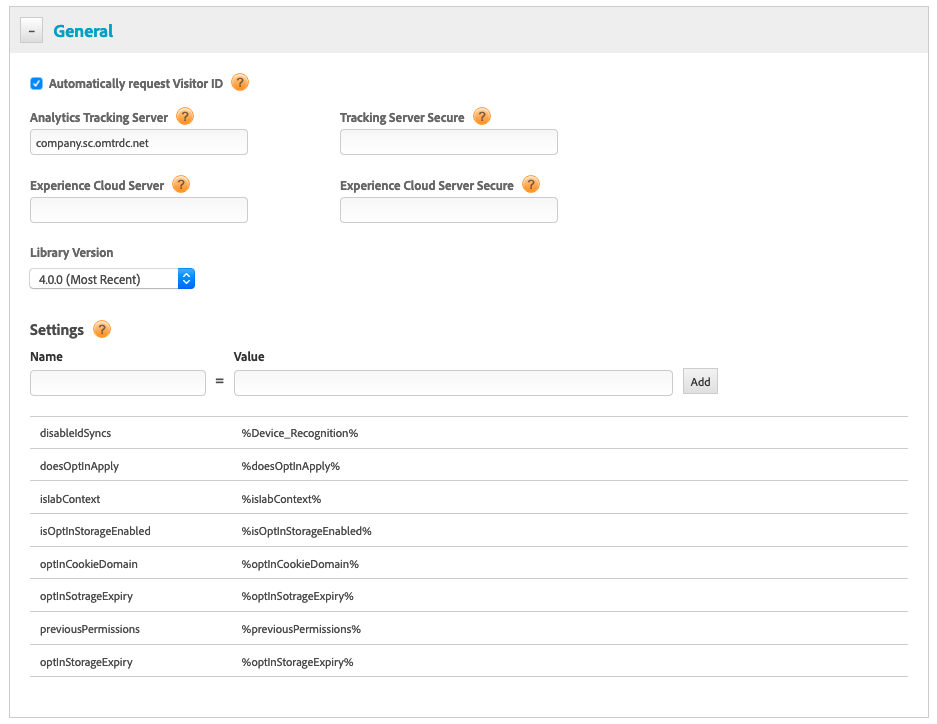

# DTM を使用したオプトインの設定 {#configuring-opt-in-with-dtm}

Dynamic Tag Management（DTM）を使用してオプトインサービスを有効にします。

DTM を使用してオプトインサービスを設定します。

必須：

* ECID 4.0.0 以降へのアップグレード。 [ECID のダウンロード](https://github.com/Adobe-Marketing-Cloud/id-service/releases)を参照してください。

DTM の「一般」ページにある[設定フィールド](/help/implementation-guides/opt-in-service/api.md)を入力します。

