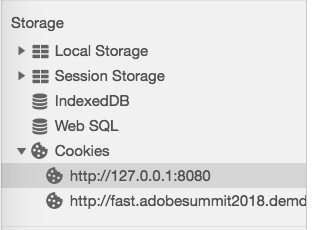

# オプトインサービスの検証{#validating-opt-in-service}

Web サイトでオプトインを有効にしたら、検証方法を使用して、ブラウザーの開発者ツールでサービスが期待どおりに動作しているかどうかをテストします。

## ユースケース 1：オプトインを有効にする {#section-c8fe1ee3711b420c8186c7057abbecb3}

```
Visitor.getInstance({{YOUR_ORG_ID}}, { 
    doesOptInApply: true 
});
```


ページを読み込む前に、キャッシュと Cookie をクリアします。

Chrome で web ページを右クリックし、「検証」を選択します。 上のスクリーンショットのように、「*ネットワーク*」タブを選択して、ブラウザーからのリクエストを表示します。

上の例では、アドビ JS タグ ECID、AAM、Analytics、Target がページにインストールされています。

**オプトインが期待どおりに動作していることを証明する方法：**

アドビサーバーへのリクエストは表示されません。

* demdex.net/id
* demdex.net/event
* omtrdc.net/b/ss
* omtrdc.net/m2
* everesttech.net

>[!NOTE]
>
>`http://dpm.demdex.net/optOutStatus` の呼び出しが表示される場合があります。これは、訪問者のオプトアウトステータスを取得するために使用される読み取り専用のエンドポイントです。最終的に、このエンドポイントでは、サードパーティの Cookie が作成されることはなく、ページから情報が収集されることもありません。

Adobe タグ（`AMCV_{{YOUR_ORG_ID}}`、`mbox`、`demdex`、`s_cc`、`s_sq`、`everest_g_v2`、`everest_session_v2`）によって作成された Cookie は表示されません。

Chromeで、「*Application*」タブに移動し、「*Storage*」の下の「*Cookies*」セクションを展開し、web サイトのドメイン名を選択します。



## ユースケース 2：オプトインとストレージを有効にする {#section-bd28326f52474fa09a2addca23ccdc0f}

```
Visitor.getInstance({{YOUR_ORG_ID}}, { 
    doesOptInApply: true, 
    isOptInStorageEnabled: true 
});
```

ユースケース 2 の唯一の違いは、訪問者から提供されるオプトイン権限を含む&#x200B;*新しい Cookie*（**adobeujs-optin**）が表示されることです。

## ユースケース 3：オプトインを有効にし Adobe Analytics を事前承認する {#section-257fe582b425496cbf986d0ec12d3692}

```
var preApproveAnalytics = {}; 
preApproveAnalytics[adobe.OptInCategories.ANALYTICS] = true;

Visitor.getInstance({{YOUR_ORG_ID}}, { 
    doesOptInApply: true, 
    preOptInApprovals: preApproveAnalytics 
});
```

Adobe Analytics は事前にオプトインが承認されているので、「Network」タブにトラッキングサーバーへのリクエストが表示されます。


また、「Application」タブに Analytics Cookie が表示されます。


## ユースケース 4：オプトインと IAB を有効にする {#section-64331998954d4892960dcecd744a6d88}

```
Visitor.getInstance({{YOUR_ORG_ID}}, { 
    doesOptInApply: true, 
    isIabContext: true 
});
```

**ページでの現在の IAB 同意を表示する方法：**

デベロッパーツールを開き、「*Console*」タブを選択します。 次のコードスニペットを貼り付け、Enter キーを押します。

```
<codeblock>
  __cmp("getVendorConsents", null, function (vendorConsents) { 
     console.log("Vendor Consent:", vendorConsents); }) 
</codeblock>  
  
```

目的 1、2、5 が承認され、Audience Manager ベンダー ID が承認された場合の出力例を次に示します。

* demdex.net/id：この呼び出しが存在する場合は、ECID が demdex.net から ID をリクエストしたことの証明になります
* demdex.net/event：この呼び出しが存在する場合は、DIL のデータ収集呼び出しが正常に動作していることの証明になります。
* demdex.net/dest5.html：この呼び出しが存在する場合は、ID 同期がトリガーされていることの証明になります。


次のいずれかの場合、アドビサーバーへのリクエストは表示されず、アドビ Cookie も表示されません。

* 目的 1、2、5 のいずれかが承認されていない。
* Audience Manager ベンダー ID が承認されていない。
