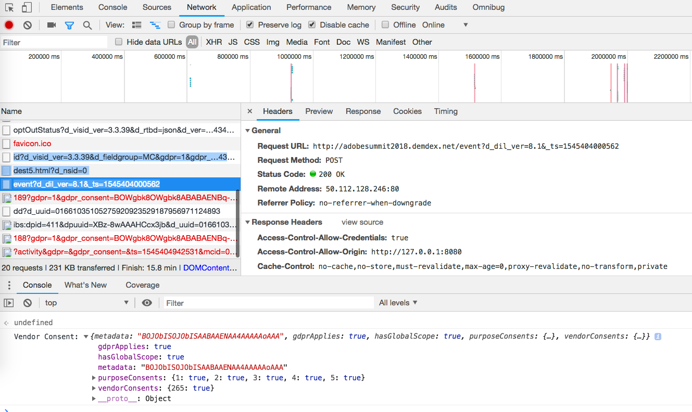

# オプトインサービスの検証{#validating-opt-in-service}

Webサイトでオプトインを有効にしたら、検証方法を使用して、ブラウザーの開発者ツールを使用して、サービスが期待どおりに動作していることをテストします。

## 使用例1:オプトインの有効化 {#section-c8fe1ee3711b420c8186c7057abbecb3}

```
Visitor.getInstance({{YOUR_ORG_ID}}, { 
    doesOptInApply: true 
});
```


ページを読み込む前に、キャッシュと Cookie を消去します。

Chrome で、Web ページを右クリックして「検証」を選択します。上のスクリーンショットのように、「*Network*」タブを選択して、ブラウザーからのリクエストを表示します。

この例では、ECID、AAM、Analytics、Target という Adobe JS タグがページにインストールされています。

**オプトインが期待どおりに動作することを証明する方法。**

アドビのサーバーに対するリクエストは表示されません。

* demdex.net/id
* demdex.net/event
* omtrdc.net/b/ss
* omtrdc.net/m2
* everesttech.net

>[!NOTE]
>
>呼び出しを確認できます。これ `http://dpm.demdex.net/optOutStatus`は、訪問者のオプトアウトステータスを取得するために使用されるREAD ONONLYエンドポイントです。このエンドポイントでは、サードパーティ Cookie が作成されることも、ページから情報が収集されることもありません。

アドビのタグによって作成された Cookie（AMCV_{{YOUR_ORG_ID}}、mbox、demdex、s_cc、s_sq、everest_g_v2、everest_session_v2）は表示されません。

Chrome で、「*Application*」タブに移動し、「*Storage*」の「*Cookies*」セクションを展開して、Web サイトのドメイン名を選択します。


## 使用例 2：オプトインとストレージを有効にする {#section-bd28326f52474fa09a2addca23ccdc0f}

```
Visitor.getInstance({{YOUR_ORG_ID}}, { 
    doesOptInApply: true, 
    isOptInStorageEnabled: true 
});
```

使用例 2 で唯一異なる点は、訪問者から提供されたオプトインの権限が含まれる*新しい Cookie* として **adobeujs-optin** が表示されることです。

## 使用例 3：オプトインを有効にして Adobe Analytics を事前承認する {#section-257fe582b425496cbf986d0ec12d3692}

```
var preApproveAnalytics = {}; 
preApproveAnalytics[adobe.OptInCategories.ANALYTICS] = true;

Visitor.getInstance({{YOUR_ORG_ID}}, { 
    doesOptInApply: true, 
    preOptInApprovals: preApproveAnalytics 
});
```

Adobe Analytics ではオプトインが事前に承認されているので、「Network」タブには、トラッキングサーバーに対するリクエストが表示されます。


さらに、「Application」タブには、Analytics の Cookie が表示されます。


## 使用例 4：オプトインと IAB を有効にする {#section-64331998954d4892960dcecd744a6d88}

```
Visitor.getInstance({{YOUR_ORG_ID}}, { 
    doesOptInApply: true, 
    isIabContext: true 
});
```

**ページに現在の IAB の同意を表示する方法：**

開発者ツールを開き、「*Console*」タブを選択します。次のコードスニペットを貼り付けて、Enter キーを押します。

```
<codeblock>
  __cmp("getVendorConsents", null, function (vendorConsents) { 
     console.log("Vendor Consent:", vendorConsents); }) 
</codeblock>  
  
```

次の出力例は、目的 1、2、5 が承認され、Audience Manager ベンダー ID が承認されたときのものです。

* demdex.net/id：この呼び出しがある場合は、ECID が demdex.net に対して ID をリクエストしたことがわかります。
* demdex.net/event：この呼び出しがある場合は、DIL データ収集呼び出しが期待どおりに動作していることがわかります。
* demdex.net/dest5.html：この呼び出しがある場合は、ID 同期がトリガーされていることがわかります。



次のいずれかが当てはまる場合、アドビのサーバーに対するリクエストは表示されず、アドビ Cookie もありません。

* 目的 1、2 または 5 が承認されていない。
* Audience Manager ベンダー ID が承認されていない。