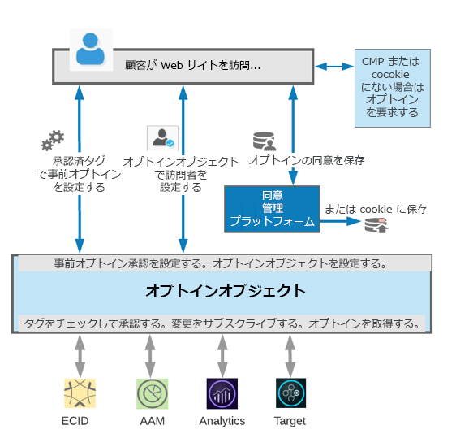

# ユーザーの同意に基づいた顧客体験のエンタープライズアクティビティの管理

Adobe [!UICONTROL Opt-in] オブジェクトは、Adobe Visitor ID サービスの拡張機能で、エンドユーザーの同意に基づいて、web ページにCookieを作成したり、ビーコンを開始したりできるCX Enterprise ソリューションを制御するのに役立つように設計されています。

## [!UICONTROL Opt-In]の基本

プライバシー規制の重要な側面は、個人データの利用方法や利用者に関するユーザーの同意の取得と伝達です。 訪問者ID サービスの最新バージョンには、エンドユーザーの同意が付与されているかどうかに基づいて、CX エンタープライズソリューションタグの条件付き起動（同意の前や後など）を提供する機能が含まれています。 このプロセスについては、次の画像をご覧ください。

[!UICONTROL Opt-in]の仕組みの

[!UICONTROL Opt-in]は次のように動作します。

**訪問者ID サービスで[!UICONTROL Opt-in]が（ブール変数を使用して）有効になっている場合、そのソリューションに対して同意が与えられるまで、CX Enterprise ソリューション ライブラリのタグの実行やCookieの設定が遅れます。**

[!UICONTROL Opt-in]では、ユーザーの同意の前にタグが適用されるかどうかを決定することもできます。その後、この同意情報（およびエンドユーザーから与えられた同意）が保存され、その後のヒットで使用できるようになります。 同意の保存は、[!UICONTROL Opt-in] オプションで利用できます。または、CMPと統合して、同意の選択を保存させることができます。

## [!UICONTROL Opt-In]の有効化と設定

[!UICONTROL Opt-in]は、タグを使用して簡単に設定できます。 方法については、次の短いビデオをご覧ください。

>[!VIDEO](https://video.tv.adobe.com/v/26431/?quality=12)

タグを使用していない場合は、[&#x200B; ドキュメント &#x200B;](https://experienceleague.adobe.com/docs/id-service/using/implementation/opt-in-service/getting-started.html?lang=ja)に示すように、グローバル訪問者オブジェクトの初期化で[!UICONTROL Opt-in]の設定を設定できます。

## ページに[!UICONTROL Opt-In]を実装しています

このセットアップとバックエンドの設定はすべて、サイト訪問者に同意オプションを提示するためのインターフェイスを提供するための準備です。 この UI は自分で作成することも、CMP（Consent Management Platform）パートナーを使用して作成することもできます。

同意を収集するために[!UICONTROL Opt-in]を使用するUIを設定する場合は、[!UICONTROL Opt-in]に接続するAPIを呼び出し、Adobe CX Enterprise ソリューションの一部またはすべてを同意するように通知するように設定する必要があります。 これらの API に関する詳細は、[オプトインリファレンスドキュメント](https://experienceleague.adobe.com/docs/id-service/using/implementation/opt-in-service/api.html?lang=ja)を参照してください。 オプトインに関する追加情報は、その前後のドキュメントページにも含まれています。

## [!UICONTROL Opt-In] デモ

次のビデオでは、ページで作業している[!UICONTROL Opt-in]の簡単なデモと、CX Enterprise ソリューションがCookieを設定したり、ビーコンを開始したりできるかどうかに与える影響について説明します。

>[!VIDEO](https://video.tv.adobe.com/v/26432/?quality=12)

**メモ：**&#x200B;この記事の執筆時点では、[!UICONTROL Opt-in]がすべてのCX Enterprise アプリケーションのライブラリに組み込まれていないことに注意してください。 現在[!UICONTROL Opt-in]でサポートされているライブラリは次のとおりです。

* 訪問者 ID サービス
* Analytics
* Audience Manager
* ターゲット

