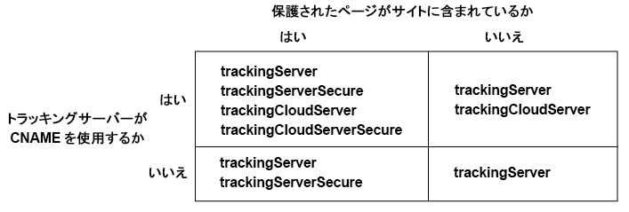

# Experience Cloud Identity Service の Analytics、Audience Manager および Target への実装 {#implement-the-experience-cloud-id-service-for-analytics-audience-manager-and-target}

これらの手順は、Experience Cloud Identity Service を使用し、Dynamic Tag Management（DTM）を使用しない Analytics、Audience Manager および Target のお客様向けです。ただし、ID サービスの実装に DTM を使用することを強くお勧めします。DTM は、実装ワークフローを合理化し、適切なコード配置と優先順位付けを自動的に確認します。

>[!IMPORTANT]
>
>ID サービスの[要件](../reference/requirements.md)を読んで、この実装に特有の以下の要件に注意してください。
>
>* s_code を使用するお客様は、この手順を完了できません。この手順を完了するには、mbox コード v61 にアップグレードします。
>* このコードを本番環境に実装する&#x200B;*前に*、開発環境で設定してテストしてください。


## 手順 1：サーバーサイド転送の計画 {#section-880797cc992d4755b29cada7b831f1fc}

ここで説明する手順に加えて、[!DNL Analytics] および [!DNL Audience Manager] を使用するお客様は、サーバーサイド転送に移行する必要があります。サーバー側転送を使用すると、DIL（Audience Manager のデータ収集コード）を削除して、[Audience Management モジュール](https://experienceleague.adobe.com/docs/audience-manager/user-guide/implementation-integration-guides/integration-other-solutions/audience-management-module.html?lang=ja)に置き換えることができます。詳しくは、[サーバー側転送のドキュメント](https://experienceleague.adobe.com/docs/analytics/admin/admin-tools/manage-report-suites/edit-report-suite/report-suite-general/server-side-forwarding/ssf.html?lang=ja)を参照してください。

サーバー側転送への移行には、計画と調整が必要です。この手順には、サイトコードに対する外部の変更と、アカウントをプロビジョニングするためにアドビが取る必要のある内部手順が関係します。実際、これらの移行手順の多くは、並行しておこない、同時にリリースする必要があります。実装パスは、このイベントの順番に従う必要があります。

1. [!DNL Analytics] と [!DNL Audience Manager] の連絡先を使用して、ID サービスおよびサーバー側転送の移行を計画します。この計画で重要な部分である、トラッキングサーバーを選択します。

1. 開始するには、[サイトの統合およびプロビジョニング](https://adobe.allegiancetech.com/cgi-bin/qwebcorporate.dll?idx=X8SVES)のフォームに入力してください。

1. ID サービスと [!DNL Audience Management Module] を同時に実装します。適切に動作させるには、[!DNL Audience Management Module]（サーバー側転送）および ID サービスがページの同じセットに同時にリリースされる必要があります。

## 手順 2：ID サービスコードのダウンロード {#section-0780126cf43e4ad9b6fc5fe17bb3ef86}

ID サービスでは、`VisitorAPI.js` コードライブラリが必要です。このコードライブラリをダウンロードするには：

1. **[!UICONTROL 管理／Code Manager]** に移動します。
1. Code Manager で、「**[!UICONTROL JavaScript (新規)]**」または「**[!UICONTROL JavaScript (レガシー)]**」をクリックします。圧縮されたコードライブラリがダウンロードされます。

1. コードファイルを解凍し、`VisitorAPI.js` ファイルを開きます。

## 手順 3：ID サービスコードへの Visitor.getInstance 関数の追加 {#section-9e30838b4d0741658a7a492153c49f27}

>[!IMPORTANT]
>
>* 以前のバージョンの ID サービス API では、この関数を別の場所に別の構文で配置する必要がありました。[バージョン 1.4](../release-notes/notes-2015.md#section-f5c596f355b14da28f45c798df513572) より前のバージョンから移行する場合は、ここで説明する新しい場所と構文について注意してください。
>* すべて大文字で書かれたコードは、実際の値用のプレースホルダーです。このテキストを組織 ID、トラッキングサーバー URL、またはその他の指定された値に置き換えます。


**パート 1：以下の Visitor.getInstance 関数をコピーします**

```js
var visitor = Visitor.getInstance("INSERT-MARKETING-CLOUD-ORGANIZATION ID-HERE", { 
     trackingServer: "INSERT-TRACKING-SERVER-HERE", // same as s.trackingServer 
     trackingServerSecure: "INSERT-SECURE-TRACKING-SERVER-HERE", // same as s.trackingServerSecure 
 
     // To enable CNAME support, add the following configuration variables 
     // If you are not using CNAME, DO NOT include these variables 
     marketingCloudServer: "INSERT-TRACKING-SERVER-HERE", 
     marketingCloudServerSecure: "INSERT-SECURE-TRACKING-SERVER-HERE" // same as s.trackingServerSecure 
}); 
```

**パート 2：Visitor API.js ファイルに関数コードを追加します**

`Visitor.getInstance` 関数をファイル末尾のコードブロックの後に配置します。編集後のファイルは以下のようになります。

```js
/* 
========== DO NOT ALTER ANYTHING BELOW THIS LINE ========== 
Version and copyright section 
*/ 
 
// Visitor API code library section 
 
// Put Visitor.getInstance at the end of the file, after the code library 
 
var visitor = Visitor.getInstance("INSERT-MARKETING-CLOUD-ORGANIZATION ID-HERE", { 
     trackingServer: "INSERT-TRACKING-SERVER-HERE", // same as s.trackingServer 
     trackingServerSecure: "INSERT-SECURE-TRACKING-SERVER-HERE", // same as s.trackingServerSecure 
 
     // To enable CNAME support, add the following configuration variables 
     // If you are not using CNAME, DO NOT include these variables 
     marketingCloudServer: "INSERT-TRACKING-SERVER-HERE", 
     marketingCloudServerSecure: "INSERT-SECURE-TRACKING-SERVER-HERE" // same as s.trackingServerSecure 
}); 
```

## 手順 4：Visitor.getInstance への Experience Cloud 組織 ID の追加 {#section-e2947313492546789b0c3b2fc3e897d8}

`Visitor.getInstance` 関数の `INSERT-MARKETING-CLOUD-ORGANIZATION ID-HERE` を Experience Cloud 組織 ID に置き換えます。組織 ID がわからない場合、Experience Cloud 管理ページで確認できます。編集後の関数は、以下のサンプルのようになります。

`var visitor = Visitor.getInstance("1234567ABC@AdobeOrg", { ...`

>[!IMPORTANT]
>
>組織 ID の大文字小文字を変更&#x200B;*しない*&#x200B;でください。この ID は大文字小文字が区別され、割り当てられたとおりに使用する必要があります。

## 手順 5：Visitor.getInstance へのトラッキングサーバーの追加 {#section-0dfc52096ac2427f86045aab9a0e0dfc}

Analytics は、データ収集にトラッキングサーバーを使用します。

**パート 1：トラッキングサーバー URL の確認**

`s_code.js` ファイルまたは `AppMeasurement.js` ファイルでトラッキングサーバー URL を確認します。この URL に以下の変数を指定します。

* `s.trackingServer`
* `s.trackingServerSecure`

**パート 2：トラッキングサーバー変数の設定**

使用するトラッキングサーバー変数を判断するには：

1. 以下の判断マトリックスの質問に答えます。自分の答えに合う変数を使用します。
1. トラッキングサーバーのプレースホルダーをトラッキングサーバー URL に置き換えます。
1. 未使用のトラッキングサーバーおよび Experience Cloud サーバーの変数をコードから削除します。



>[!NOTE]
>
>使用されている場合は、以下のように Experience Cloud サーバーの URL をトラッキングサーバーの URL に対応させます。

* Experience Cloud サーバー URL = トラッキングサーバー URL
* Experience Cloud サーバーセキュア URL = トラッキングサーバーセキュア URL

トラッキングサーバーの見つけ方がわからない場合は、[FAQ](../faq-intro/faq.md) と [trackingServer および trackingServerSecure 変数の適切な設定](https://helpx.adobe.com/jp/analytics/kb/determining-data-center.html#)を参照してください。

## 手順 6：AppMeasurement.js ファイルの更新 {#section-5517e94a09bc44dfb492ebca14b43048}

この手順には、[!UICONTROL AppMeasurement] が必要です。s_code を使用している場合、続行できません。

以下に示す `Visitor.getInstance` 関数を `AppMeasurement.js` ファイルに追加します。`linkInternalFilters`、`charSet`、`trackDownloads` などの設定を含むセクションに配置します。

`s.visitor = Visitor.getInstance("INSERT-MARKETING-CLOUD-ORGANIZATION ID-HERE");`

>[!IMPORTANT]
>
>この時点で、[!DNL Audience Manager] DIL コードを削除して、Audience Management モジュールに置き換える必要があります。手順については、[サーバー側転送の実装](https://experienceleague.adobe.com/docs/analytics/admin/admin-tools/server-side-forwarding/ssf.html?lang=ja)を参照してください。

***（オプション、推奨）* カスタム prop の作成。**

有効範囲を測定するために `AppMeasurement.js` にカスタム prop を設定します。このカスタム prop を `doPlugins` ファイルの `AppMeasurement.js` 関数に追加します。

```js
// prop1 is used as an example only. Choose any available prop. 
s.prop1 = (typeof(Visitor) != "undefined" ? "VisitorAPI Present" : "VisitorAPI Missing");
```

## 手順 7：ページへの Visitor API コードの追加 {#section-c2bd096a3e484872a72967b6468d3673}

` [!UICONTROL VisitorAPI.js]` ファイルを各ページの `<head>` タグ内に配置します。`VisitorAPI.js` ファイルをページに配置する際には、以下のようにします。

* タグは `<head>` セクションの先頭に配置して、他のソリューションタグより先に表示させます。
* AppMeasurement およびその他の [!DNL Experience Cloud] ソリューションのコードより前に実行する必要があります。

## 手順 8：（オプション）猶予期間の設定 {#section-aceacdb7d5794f25ac6ff46f82e148e1}

これらの使用例のいずれかがお客様の状況に当てはまる場合は、[カスタマーケア](https://helpx.adobe.com/jp/marketing-cloud/contact-support.html)までお問い合わせいただき、一時的な[猶予期間](../reference/analytics-reference/grace-period.md)を設定するよう依頼してください。猶予期間は最大 180 日です。必要に応じて、猶予期間を更新できます。

**部分的実装**

ID サービスを使用するページと使用しないページが混在し、そのすべてのページが同じ Analytics レポートスイートで管理される場合は、猶予期間が必要です。この状況は、複数のドメインで管理されるグローバルなレポートスイートがある場合に一般的です。

同じレポートスイートで管理されるすべての Web ページに ID サービスをデプロイした後に、猶予期間を停止します。

**s_vi Cookie の要件**

新しい訪問者が ID サービスへの移行後に s_vi Cookie を使用する必要がある場合、猶予期間が必要です。この状況は、実装で s_vi Cookie を読み取って変数に保存している場合に一般的です。

実装で s_vi Cookie を読み取る代わりに MID を取得できるようになった後に、猶予期間を停止します。

詳しくは、[Cookie と Experience Cloud Identity Service](../introduction/cookies.md) を参照してください。

**クリックストリームデータの統合**

クリックストリームデータフィードから内部システムにデータを送信していて、そのプロセスで `visid_high` 列と `visid_low` 列を使用している場合、猶予期間が必要です。

データ収集プロセスで `post_visid_high` 列と `post_visid_low` 列を使用できるようになった後で、猶予期間を停止します。

[クリックストリームデータ列リファレンス](https://experienceleague.adobe.com/docs/analytics/export/analytics-data-feed/data-feed-overview.html?lang=ja)も参照してください。

## 手順 9：テストと検証 {#section-f857542bfc70496dbb9f318d6b3ae110}

この実装の [!DNL Experience Cloud] ソリューションは、キーと値のペアの形式で ID を返します。各ソリューションは異なるキーを使用して（例：[!DNL Analytics] SDID と [!DNL Target] mboxMCSDID）、同じ ID を保持します。実装をテストするには、開発環境にページを読み込みます。HTTP リクエストと応答を監視するブラウザーコンソールまたはソフトウェアを使用して、以下に示す ID をチェックします。以下にリストされたキーと値のペアが同じ ID 値を返す場合、ID サービスは適切に実装されています。

>[!TIP]
>
>[Adobe Debugger](https://experienceleague.adobe.com/docs/analytics/implementation/validate/debugger.html?lang=ja) または [Charles HTTP プロキシ](https://www.charlesproxy.com/)を使用して、これらのソリューション特有の ID をチェックできます。ただし、お客様に最適なツールやデバッガーを自由に使用することができます。

**すべてのソリューション**

以下をチェックします。

* [AMCV Cookie](../introduction/cookies.md)（ページがホストされているドメイン内）
* [!DNL Experience Cloud] ID（MID）（[!DNL Adobe] Debugger または任意のデバッギングツールを使用）

ID サービスが正常に動作しているかどうかを判断するのに役立つ追加のチェックについては、[Experience Cloud Identity Service のテストと検証](../implementation-guides/test-verify.md)を参照してください。

**Analytics**

JavaScript リクエストの SDID 識別子をチェックします。Analytics SDID は、Target mboxMCSDID と一致する必要があります。

テストで AID が返される場合、以下のいずれかであることを示します。

* 従来の [!DNL Analytics] ID の移行の過程での再訪問者である。
* [猶予期間](../reference/analytics-reference/grace-period.md)を有効にしている。

AID が表示される場合、[!DNL Target] mboxMCAVID に対するその値をチェックします。ID サービスが適切に実装されている場合、これらの値は同一です。

**Audience Manager**

サーバー側転送を検証するには、[サーバー側転送の実装の確認方法](https://experienceleague.adobe.com/docs/analytics/admin/admin-tools/server-side-forwarding/ssf-verify.html?lang=ja)を参照してください。

**Target**

以下をチェックします。

* mboxMCGVID
* mboxMCSDID（mboxMCSDID は、Analytics SDID と一致する必要があります。）

テストで mboxMCAVID が返される場合、以下のいずれかであることを示します。

* 従来の [!DNL Analytics] ID の移行の過程での再訪問者である。
* 猶予期間を有効にしている。

mboxMCAVID が表示される場合、[!DNL Analytics] AID に対するその値をチェックします。ID サービスが適切に実装されている場合、これらの値は同一です。

**デプロイ**

## 手順 10：デプロイ {#section-4188fa95e7dc455a986b48a6c517c1c9}

テストの合格後に、コードをデプロイします。

猶予期間を有効にしている場合：

* Analytics ID（AID）と MID がイメージリクエストに含まれていることを確認します。
* [停止条件](../implementation-guides/setup-aam-analytics-target.md#section-aceacdb7d5794f25ac6ff46f82e148e1)が満たされたら、必ず猶予期間を無効にします。
