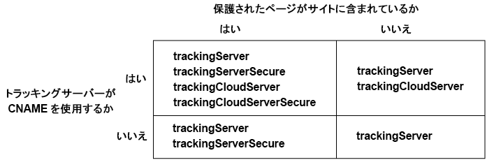

# Analytics、Audience Manager、Target用のAdobe Visitor ID サービスの実装 {#implement-the-experience-cloud-id-service-for-analytics-audience-manager-and-target}

この手順は、Analytics、Audience Manager、Targetのお客様向けに、Visitor ID サービスを使用し、[tags](https://experienceleague.adobe.com/docs/experience-platform/tags/home.html?lang=ja)を使用しない場合に表示されます。 ただし、タグを使用して訪問者ID サービスを実装することを強くお勧めします。 タグは、実装ワークフローを効率化し、適切なコードの配置とシーケンスを自動的に保証します。

>[!IMPORTANT]
>
>開始する前に、訪問者ID サービス [要件](../reference/requirements.md)を読み、この実装に固有の次の要件に注意してください。
>
>* s_code を使用するお客様は、この手順を完了できません。 この手順を完了するには、mbox コード v61 にアップグレードします。
>* このコードを本番環境に実装する&#x200B;*前に*、開発環境で設定してテストしてください。

## 手順 1：サーバーサイド転送の計画 {#section-880797cc992d4755b29cada7b831f1fc}

ここで説明する手順に加えて、AnalyticsとAudience Managerを使用しているお客様は、サーバーサイド転送に移行する必要があります。 サーバー側転送を使用すると、DIL（Audience Manager のデータ収集コード）を削除して、[Audience Management モジュール](https://experienceleague.adobe.com/docs/audience-manager/user-guide/implementation-integration-guides/integration-other-solutions/audience-management-module.html?lang=ja)に置き換えることができます。 詳しくは、[サーバー側転送のドキュメント](https://experienceleague.adobe.com/docs/analytics/admin/admin-tools/manage-report-suites/edit-report-suite/report-suite-general/server-side-forwarding/ssf.html?lang=ja)を参照してください。

サーバー側転送への移行には、計画と調整が必要です。 この手順には、サイトコードに対する外部の変更と、アカウントをプロビジョニングするためにアドビが取る必要のある内部手順が関係します。 実際、これらの移行手順の多くは、並行しておこない、同時にリリースする必要があります。 実装パスは、このイベントの順番に従う必要があります。

1. AnalyticsおよびAudience Managerの連絡先と連携して、Visitor ID サービスとサーバーサイド転送の移行を計画します。 この計画で重要な部分である、トラッキングサーバーを選択します。

1. 開始するには、[サイトの統合およびプロビジョニング](https://adobe.allegiancetech.com/cgi-bin/qwebcorporate.dll?idx=X8SVES)のフォームに入力してください。

1. 訪問者ID サービスとオーディエンス管理モジュールを同時に実装します。 オーディエンス管理モジュール（サーバーサイド転送）と訪問者ID サービスは、同じページのセットに対して同時にリリースする必要があります。

## 手順2：訪問者ID サービスコードのダウンロード {#section-0780126cf43e4ad9b6fc5fe17bb3ef86}

訪問者ID サービスには、`VisitorAPI.js` コードライブラリが必要です。 このコードライブラリをダウンロードするには：

1. **[!UICONTROL Admin > Code Manager]**&#x200B;に移動します。
1. Code Managerで、**[!UICONTROL JavaScrpt (New)]**&#x200B;または&#x200B;**[!UICONTROL JavaScript (Legacy)]**&#x200B;のいずれかをクリックします。 圧縮されたコードライブラリがダウンロードされます。

1. コードファイルを解凍し、`VisitorAPI.js` ファイルを開きます。

## 手順3：訪問者ID サービスコードにVisitor.getInstance関数を追加する {#section-9e30838b4d0741658a7a492153c49f27}

>[!IMPORTANT]
>
>* 以前のバージョンの訪問者ID サービス APIでは、この関数を別の場所に配置し、別の構文が必要でした。 [バージョン 1.4](../release-notes/notes-2015.md#section-f5c596f355b14da28f45c798df513572) より前のバージョンから移行する場合は、ここで説明する新しい場所と構文について注意してください。
>* すべて大文字で書かれたコードは、実際の値用のプレースホルダーです。 このテキストを、IMS組織ID、トラッキングサーバーURL、またはその他の名前付き値に置き換えます。

**パート 1：以下の Visitor.getInstance 関数をコピーします**

```js
var visitor = Visitor.getInstance("INSERT-IMS-ORG-ID-HERE", { 
     trackingServer: "INSERT-TRACKING-SERVER-HERE", // same as s.trackingServer 
     trackingServerSecure: "INSERT-SECURE-TRACKING-SERVER-HERE", // same as s.trackingServerSecure 
 
     // To enable CNAME support, add the following configuration variables 
     // If you are not using CNAME, DO NOT include these variables 
     marketingCloudServer: "INSERT-TRACKING-SERVER-HERE", 
     marketingCloudServerSecure: "INSERT-SECURE-TRACKING-SERVER-HERE" // same as s.trackingServerSecure 
}); 
```

**パート 2: `VisitorAPI.js` ファイルに関数コードを追加**

`Visitor.getInstance` 関数をファイル末尾のコードブロックの後に配置します。 編集後のファイルは以下のようになります。

```js
/* 
========== DO NOT ALTER ANYTHING BELOW THIS LINE ========== 
Version and copyright section 
*/ 
 
// Visitor API code library section 
 
// Put Visitor.getInstance at the end of the file, after the code library 
 
var visitor = Visitor.getInstance("INSERT-IMS-ORG-ID-HERE", { 
     trackingServer: "INSERT-TRACKING-SERVER-HERE", // same as s.trackingServer 
     trackingServerSecure: "INSERT-SECURE-TRACKING-SERVER-HERE", // same as s.trackingServerSecure 
 
     // To enable CNAME support, add the following configuration variables 
     // If you are not using CNAME, DO NOT include these variables 
     marketingCloudServer: "INSERT-TRACKING-SERVER-HERE", 
     marketingCloudServerSecure: "INSERT-SECURE-TRACKING-SERVER-HERE" // same as s.trackingServerSecure 
}); 
```

## ステップ 4: Visitor.getInstanceにIMS組織IDを追加する {#section-e2947313492546789b0c3b2fc3e897d8}

`Visitor.getInstance`関数で、`INSERT-IMS-ORG-ID-HERE`をIMS組織IDに置き換えます。 IMS組織IDがわからない場合は、CX Enterprise管理ページで確認できます。 編集後の関数は、以下のサンプルのようになります。

`var visitor = Visitor.getInstance("1234567ABC@AdobeOrg", { ...`

>[!IMPORTANT]
>
>*IMS組織IDの文字の大文字と小文字を変更しないでください。* この ID は大文字小文字が区別され、割り当てられたとおりに使用する必要があります。

## 手順 5：Visitor.getInstance へのトラッキングサーバーの追加 {#section-0dfc52096ac2427f86045aab9a0e0dfc}

Analytics は、データ収集にトラッキングサーバーを使用します。

**パート 1：トラッキングサーバー URL の確認**

`s_code.js` ファイルまたは `AppMeasurement.js` ファイルでトラッキングサーバー URL を確認します。 この URL に以下の変数を指定します。

* `s.trackingServer`
* `s.trackingServerSecure`

**パート 2：トラッキングサーバー変数の設定**

使用するトラッキングサーバー変数を判断するには：

1. 以下の判断マトリックスの質問に答えます。 自分の答えに合う変数を使用します。
1. トラッキングサーバーのプレースホルダーをトラッキングサーバー URL に置き換えます。
1. 未使用のトラッキングサーバーおよびCX エンタープライズサーバー変数をコードから削除します。



>[!NOTE]
>
>使用する場合、CX Enterprise サーバーのURLを、次のような対応するトラッキングサーバーのURLと一致させます。

* CX Enterprise Server URL = トラッキングサーバーURL
* CX Enterprise Serverのセキュア URL = トラッキングサーバーのセキュア URL

トラッキングサーバーの見つけ方がわからない場合は、[FAQ](../faq-intro/faq.md) と [trackingServer および trackingServerSecure 変数の適切な設定](https://helpx.adobe.com/jp/analytics/kb/determining-data-center.html#)を参照してください。

## 手順 6：AppMeasurement.js ファイルの更新 {#section-5517e94a09bc44dfb492ebca14b43048}

この手順には、[!UICONTROL AppMeasurement] が必要です。 s_code を使用している場合、続行できません。

以下に示す `Visitor.getInstance` 関数を `AppMeasurement.js` ファイルに追加します。 `linkInternalFilters`、`charSet`、`trackDownloads` などの設定を含むセクションに配置します。

`s.visitor = Visitor.getInstance("INSERT-IMS-ORG-ID-HERE");`

>[!IMPORTANT]
>
>この時点で、Audience Manager DIL コードを削除し、Audience Management Moduleに置き換える必要があります。 手順については、[サーバー側転送の実装](https://experienceleague.adobe.com/docs/analytics/admin/admin-tools/server-side-forwarding/ssf.html?lang=ja)を参照してください。

***（オプション、推奨）* カスタム prop の作成。**

有効範囲を測定するために `AppMeasurement.js` にカスタム prop を設定します。 このカスタム prop を `doPlugins` ファイルの `AppMeasurement.js` 関数に追加します。

```js
// prop1 is used as an example only. Choose any available prop. 
s.prop1 = (typeof(Visitor) != "undefined" ? "VisitorAPI Present" : "VisitorAPI Missing");
```

## 手順 7：ページへの Visitor API コードの追加 {#section-c2bd096a3e484872a72967b6468d3673}

`VisitorAPI.js` ファイルを各ページの `<head>` タグ内に配置します。 `VisitorAPI.js` ファイルをページに配置する際には、以下のようにします。

* タグは `<head>` セクションの先頭に配置して、他のソリューションタグより先に表示させます。
* AppMeasurementやその他のCX Enterprise ソリューションのコードよりも前に実行する必要があります。

## 手順 8：（オプション）猶予期間の設定 {#section-aceacdb7d5794f25ac6ff46f82e148e1}

これらのユースケースのいずれかが状況に適用される場合は、[&#x200B; カスタマーケア &#x200B;](https://helpx.adobe.com/jp/marketing-cloud/contact-support.html)に一時的な猶予期間の設定を依頼してください。 猶予期間は最大 180 日です。 必要に応じて、猶予期間を更新できます。

**部分的実装**

Visitor ID サービスを使用するページとそうでないページがあり、すべてのページが同じAnalytics レポートスイートにレポートされる場合は、猶予期間が必要です。 この状況は、複数のドメインで管理されるグローバルなレポートスイートがある場合に一般的です。

同じレポートスイートにレポートするすべてのweb ページに訪問者ID サービスをデプロイした後、猶予期間を終了します。

**s_vi Cookie の要件**

訪問者ID サービスに移行した後、新しい訪問者にs_vi Cookieを付与する必要がある場合は、猶予期間が必要です。 この状況は、実装で s_vi Cookie を読み取って変数に保存している場合に一般的です。

実装で s_vi Cookie を読み取る代わりに MID を取得できるようになった後に、猶予期間を停止します。

[Cookieと訪問者ID サービス &#x200B;](../introduction/cookies.md)も参照してください。

**クリックストリームデータの統合**

クリックストリームデータフィードから内部システムにデータを送信していて、そのプロセスで `visid_high` 列と `visid_low` 列を使用している場合、猶予期間が必要です。

データ収集プロセスで `post_visid_high` 列と `post_visid_low` 列を使用できるようになった後で、猶予期間を停止します。

[クリックストリームデータ列リファレンス](https://experienceleague.adobe.com/docs/analytics/export/analytics-data-feed/data-feed-overview.html?lang=ja)も参照してください。

## 手順 9：テストと検証 {#section-f857542bfc70496dbb9f318d6b3ae110}

この実装のCX Enterprise ソリューションは、キーと値のペアの形式でIDを返します。 各ソリューションは、同じIDを保持するために異なるキー（Analytics SDIDとTarget mboxMCSDIDなど）を使用します。 実装をテストするには、開発環境にページを読み込みます。 HTTP リクエストと応答を監視するブラウザーコンソールまたはソフトウェアを使用して、以下に示す ID をチェックします。 以下に示すキーと値のペアが同じID値を返す場合、訪問者ID サービスが正しく実装されました。

>[!TIP]
>
>[Adobe Debugger](https://experienceleague.adobe.com/docs/analytics/implementation/validate/debugger.html?lang=ja) または [Charles HTTP プロキシ](https://www.charlesproxy.com/)を使用して、これらのソリューション特有の ID をチェックできます。 ただし、お客様に最適なツールやデバッガーを自由に使用することができます。

**すべてのソリューション**

以下をチェックします。

* [AMCV Cookie](../introduction/cookies.md)（ページがホストされているドメイン内）
* ADOBE デバッガーまたは任意のデバッグツールでのECID。

訪問者ID サービスが正しく機能しているかどうかを判断するのに役立つ追加のチェックについては、[訪問者ID サービスのテストと検証](../implementation-guides/test-verify.md)を参照してください。

**Analytics**

JavaScript リクエストの SDID 識別子をチェックします。 Analytics SDID は、Target mboxMCSDID と一致する必要があります。

テストで AID が返される場合、以下のいずれかであることを示します。

* 従来のAnalytics IDを移行するプロセスの再訪問者です。
* [猶予期間](https://experienceleague.adobe.com/en/docs/analytics/implementation/id/migration)を有効にしている。

AIDが表示されたら、その値をTarget mboxMCAVIDと比較します。 これらの値は、訪問者ID サービスが正しく実装されている場合と同じです。

**Audience Manager**

サーバー側転送を検証するには、[サーバー側転送の実装の確認方法](https://experienceleague.adobe.com/docs/analytics/admin/admin-tools/server-side-forwarding/ssf-verify.html?lang=ja)を参照してください。

**Target**

以下をチェックします。

* mboxMCGVID
* mboxMCSDID（mboxMCSDID は、Analytics SDID と一致する必要があります。）

テストで mboxMCAVID が返される場合、以下のいずれかであることを示します。

* 従来のAnalytics IDを移行するプロセスの再訪問者です。
* 猶予期間を有効にしている。

mboxMCAVIDが表示されたら、その値をAnalytics AIDに照らし合わせて確認します。 これらの値は、訪問者ID サービスが正しく実装されている場合と同じです。

**デプロイ**

## 手順 10：デプロイ {#section-4188fa95e7dc455a986b48a6c517c1c9}

テストの合格後に、コードをデプロイします。

猶予期間を有効にしている場合：

* Analytics ID（AID）と MID がイメージリクエストに含まれていることを確認します。
* [停止条件](../implementation-guides/setup-aam-analytics-target.md#section-aceacdb7d5794f25ac6ff46f82e148e1)が満たされたら、必ず猶予期間を無効にします。

