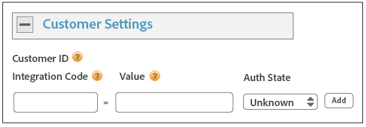

# Dynamic Tag Management を使用した実装 {#implementation-with-dynamic-tag-management}

従来の実装では、Dynamic Tag Management（DTM）を使用して、Experience Cloud Identity Service を設定してデプロイし、他の Experience Cloud ソリューションと統合します。

## Dynamic Tag Management を使用した実装 {#topic-6f4ed5d96977406ca991e50f3fbd5b01}

従来の実装では、Dynamic Tag Management（DTM）を使用して、Experience Cloud Identity Service を設定してデプロイし、他の Experience Cloud ソリューションと統合します。

>[!NOTE]
>
>現在、[Adobe Experience Platform Launch](https://docs.adobe.com/content/help/ja-JP/launch/using/overview.html) は、複雑なタグ管理タスクの簡略化およびコード配置の自動化に DTM の機能よりも役立つので、実装することをお勧めします。[Launch による実装](../implementation-guides/ecid-implement-with-launch.md)を参照してください。

## Dynamic Tag Management と ID サービス {#section-4a4c4fac5d0a4cbbaff8e1833f73657c}

[Dynamic Tag Management](https://docs.adobe.com/content/help/ja-JP/dtm/using/dtm-home.html) では、ID サービスインスタンスおよび [!DNL Experience Cloud] と関連するソリューション統合の設定、デプロイ、管理をおこなえます。DTMを使用すると、IDサービスおよびその他のExperience Cloudソリューションと緊密に統合されているので、実装プロセスをシンプル化できます。 Experience Cloud IDツールを追加して設定するだけで、次のような情報を指定できます。

* Experience Cloud組織ID（Experience Cloudにリンクすると自動的に設定されます）
* Analyticsトラッキングサーバー（セキュアおよび非セキュア）
* Experience Cloudサーバー（ファーストパーティのトラッキングサーバー用）

すべての [!DNL Experience Cloud] のお客様は、DTM を無料で利用できます。

**DTM はじめに**

DTMはシンプルで強力なツールです。 まだ使用していない場合は、使用することを強くお勧めします。 このサービスの使用を開始するには、 [DTMドキュメント](https://docs.adobe.com/content/help/ja-JP/dtm/using/c-overview.html) を参照してください。 DTM を使用した ID サービスの設定方法の手順については、以下の節の情報および手順を参照してください。

## デプロイのガイドライン {#concept-54a2ec49af8f4bfca9207b1d404e8e1a}

Dynamic Tag Management（DTM）を使用して Experience Cloud Identity Service を実装する前に、以下の要件と手順を確認してください。

<!--
mcvid-dtm-deployment.xml
-->

**アカウントのプロビジョニング**

始める前に、組織とソリューションが [!DNL Experience Cloud] 用にプロビジョニングされていることを確認してください。また、[!DNL Dyanamic Tag Management] について理解している必要があります。このドキュメントは、操作を開始する際に役立つ情報を提供します。

* [コアサービス向けのソリューションの有効化](https://docs.adobe.com/content/help/ja-JP/core-services/interface/about-core-services/core-services.html)：Experience Cloud を実装し、管理者になります。このプロセスでは、顧客属性や Experience Cloud オーディエンスなどコアサービスのソリューションを最新化します。
* [Dynamic Tag Management の概要](https://docs.adobe.com/content/help/en/dtm/using/getting-started/get-started.html)

**ID サービスコードの配置と読み込み順序**

ID サービスは、[!DNL Adobe] データ収集サーバーに一意の ID をリクエストし、受け取ることによって機能します。適切に動作させるには、ID サービスコードを以下のようにする必要があります。

* ページで実行する [!DNL Adobe] コードの最初のブロックである。
* 可能な限りページの最初に配置する（通常は、`<head>` コードブロック内）。

すべての [!DNL Adobe] ソリューションおよび DTM のコードライブラリを自分で維持している限り、確実に ID サービスコードが適切な場所に配置され、適切なタイミングで実行されます。

**地域データ収集の検証**

顧客は、[地域データ収集](https://docs.adobe.com/content/help/en/analytics/technotes/rdc/regional-data-collection.html)（RDC）に関して、CNAME を提供するか、`*.sc.omtrdc` を使用する必要があります。[!DNL Adobe] のコンサルタントから、特定の RDC 設定を取得します。

**Analytics レポートスイートの設定**

新規 [!DNL Analytics] ユーザーは、データ収集用の[レポートスイートを作成](https://docs.adobe.com/content/help/ja-JP/analytics/admin/manage-report-suites/new-report-suite/new-report-suite.html)する必要があります。

## DTM を使用した Experience Cloud Identity Service の実装 {#task-a659cf19dea84ad48edabe0b72ef9f5c}

Dynamic Tag Management(DTM)を使用してIDサービスを実装するには、次の手順に従います。

**前提条件**

* [!DNL Experience Cloud] のソリューションを有効にして、管理者権限があることを確認します。[コアサービス向けにソリューションを有効化](https://docs.adobe.com/content/help/ja-JP/core-services/interface/about-core-services/core-services.html)を参照してください。

* DTM で Web プロパティを作成します。DTMのWebプロパティの [作成のドキュメントを参照してください](https://docs.adobe.com/content/help/en/dtm/using/admin/web-property.html) 。

<!--
mcvid-dtm-implement.xml
-->

**実装手順** DTM を使用して ID サービスを実装するには：

1. DTM [!UICONTROL ダッシュボード]で、作業対象の Web プロパティをクリックします。
1. 選択した Web プロパティの「**[!UICONTROL 概要]**」タブで、「**[!UICONTROL ツールを追加]**」をクリックします。
1. 「**[!UICONTROL ツールタイプ]**」リストで、「**[!UICONTROL Experience Cloud Identity Service]**」をクリックします。

   >[!NOTE]
   >
   >この操作によって、「**[!UICONTROL Experience Cloud 組織 ID]**」ボックスに組織 ID が入力されます。DTM アカウントが [!DNL Experience Cloud] にリンクされていない場合、この ID を指定する必要があります。アカウントをリンクするには、[Experience Cloud でのアカウントのリンク](https://docs.adobe.com/content/help/ja-JP/core-services/interface/manage-users-and-products/organizations.html)を参照してください。組織 ID を見つける方法については、[要件](../reference/requirements.md#section-a02f537129a64ffbb690d5738d360c26)を参照してください。

1. **[!UICONTROL トラッキングサーバー]**&#x200B;ボックスに、トラッキングサーバーの名前を入力します。トラッキングサーバーの見つけ方が分からない場合は、[FAQ](../faq-intro/faq.md) と [trackingServer および trackingServerSecure 変数の適切な設定](https://helpx.adobe.com/jp/analytics/kb/determining-data-center.html#)を参照してください。
1. 「**[!UICONTROL ツールを作成]**」および「**[!UICONTROL 変更を保存]**」をクリックします。

   保存後、IDサービスはDTMのツールとして設定されます。 ただし、まだ使用する準備は整っていません。 DTMツールでは、DTMの公開/承認プロセスを実行する必要があり、必要に応じて、追加のパラメーターを設定することもできます。 DTM に追加できる追加パラメーターについて詳しくは、[DTM 用の Experience Cloud Identity Service 設定](../implementation-guides/standard.md#concept-fb6cb6a0e6cc4f10b92371f8671f6b59)を参照してください。

## DTM 用の Experience Cloud Identity Service 設定 {#concept-fb6cb6a0e6cc4f10b92371f8671f6b59}

[!UICONTROL 組織 ID]、[!UICONTROL 一般設定]および[!UICONTROL 顧客設定]のフィールドおよび [!DNL Experience Cloud] ID サービスでの使用方法について説明します。

<!--
mcvid-dtm-settings.xml
-->

## これらの設定の見つけ方 {#section-c5b2d1c928944ae2b8565c1b182fe575}

設定は、ID サービスを Dynamic Tag Management（DTM）のツールとして追加して保存した後で利用できます。You can also access these settings by clicking the gear icon from the [!UICONTROL Installed Tools] section of your DTM web property.


## 組織 ID {#section-949b5a0d8af940558b04ff675cf53f77}

これは、プロビジョニングされた [!DNL Experience Cloud] の会社に必要で、その会社に関連付けられた ID です。組織は、管理者がユーザーおよびグループを設定し、[!DNL Experience Cloud] でのシングルサインオンアクセスを制御することを可能にするエンティティです。組織 ID は、24 文字の英数字から成る文字列で、その後に @AdobeOrg（必須）が続きます。[!DNL Experience Cloud] 管理者は、[Experience Cloud／ツール](https://docs.adobe.com/content/help/ja-JP/core-services/interface/manage-users-and-products/admin-getting-started.html)でこの ID を見つけることができます。


詳しくは、[Cookie と Experience Cloud Identity Service](../introduction/cookies.md) を参照してください。

## 一般設定{#section-071d358e40f84629a8901b893dd61392}

これらの設定を使用すると、トラッキングサーバーおよびコードバージョンを指定したり、その他の変数を追加したりできます。


The following table lists and defines the [!UICONTROL General] settings.

**訪問者 ID を自動的にリクエスト**

オンにすると、Dynamic Tag Management は、Experience Cloud Identity Service を使用するアドビソリューションを読み込む前に、`getMarketingCloudVisitorID()` メソッドを自動的に呼び出します。

[getMarketingCloudVisitorID](../library/get-set/getmcvid.md) を参照してください。

**Analyticsトラッキングサーバー**

Analyticsデータ収集に使用するトラッキングサーバーの名前。 これは、イメージリクエストおよび Cookie が記述されたドメインです（例：`http://site.omtrdc.net`）。

トラッキングサーバーの URL がわからない場合は、`s_code.js` または `AppMeasurement.js` ファイルを確認します。`s.trackingServer` 変数で URL を設定することもできます。

[trackingServer](https://docs.adobe.com/content/help/ja-JP/analytics/implementation/vars/page-vars/page-variables.html) と [trackingServer および trackingServerSecure 変数の適切な設定](https://helpx.adobe.com/jp/analytics/kb/determining-data-center.html#) を参照してください。

**トラッキングサーバーセキュリティ**

Analyticsのデータ収集に使用するセキュリティで保護されたトラッキングサーバーの名前。 これは、イメージリクエストおよび Cookie が記述されたドメインです（例：`https://site.omtrdc.net`）。

トラッキングサーバーの URL がわからない場合は、`s_code.js` または `AppMeasurement.js` ファイルを確認します。`s.trackingServerSecure` 変数で URL を設定することもできます。

[trackingServer](https://docs.adobe.com/content/help/ja-JP/analytics/implementation/vars/page-vars/page-variables.html) と [trackingServer および trackingServerSecure 変数の適切な設定](https://helpx.adobe.com/jp/analytics/kb/determining-data-center.html#) を参照してください。

**Experience Cloud サーバー**

ファーストパーティのデータ収集（CNAME）を使用して、サードパーティのコンテキストでファーストパーティ Cookie を利用する場合は、ここにトラッキングサーバー（例：`http://metrics.company.com`）を入力します。

**Experience Cloud サーバー保護**

ファーストパーティのデータ収集（CNAME）を使用して、サードパーティのコンテキストでファーストパーティ Cookie を利用する場合は、ここにトラッキングサーバー（例：`https://metrics.company.com`）を入力します。

**ライブラリバージョン**

使用する ID サービスコードライブラリ（`VisitorAPI.js`）のバージョンを設定します。これらのメニューオプションは編集できません。

**設定**

これらのフィールドを使用して、 [関数変数](../library/function-vars/function-vars.md) 、キーと値のペアを追加できます。 「**[!UICONTROL 追加]**」をクリックして、1 つまたは複数の変数を ID サービス実装に追加します。


>[!IMPORTANT]
>
>ここで `cookieDomain` 変数を設定します。これは、URLの末尾2つのパートのいずれかが3文字以上から成るマルチパートのトップレベルドメインの場合に必要です。 上記のリンクを含む設定変数のドキュメントを参照してください。

## 顧客設定 {#section-238d1272c1504d148fe38fb0ae5d71c2}

統合コードまたは認証状態ステータスを追加できる、追加のフィールドです。



**統合コード**

統合コードは、一意の、顧客が提供するIDです。 統合コードには、[ で](hhttps://docs.adobe.com/content/help/en/audience-manager/user-guide/features/data-sources/manage-datasources.html#create-data-source)データソースを作成[!DNL Audience Manager]するために使用された値が含まれている必要があります。

**値**

値は、ユーザーIDを含むデータ要素にする必要があります。 データ要素は、動的な値（例えば、クライアント固有の内部システムのID）に適したコンテナです。

**認証状態**

訪問者の認証状態（ログイン済み、ログアウト済みなど）に従って認証を定義または識別するオプション。 詳しくは、[顧客 ID と認証状態](../reference/authenticated-state.md)を参照してください。

## Experience Cloud Identity Service のテストと検証 {#concept-644fdbef433b46ba9c0634ac95eaa680}

これらの説明、ツール、手順は、ID サービスが適切に動作しているかどうかを判定するのに役立ちます。これらのテストは、一般に、ID サービスに適用され、様々な ID サービスと [!DNL Experience Cloud] ソリューションの組み合わせに適用されます。

<!--
mcvid-test-verify.xml
-->

## 始める前に{#section-b1e76ad552ed4eb793b6e521a55127d4}

ID サービスのテストと検証を始める前に知っておくべき重要な情報です。

**ブラウザー環境**

通常のブラウザーセッションでテストを行う場合は、各テストの前にブラウザーのキャッシュをクリアします。

また、匿名のブラウザーセッションでIDサービスをテストすることもできます。 匿名セッションでは、各テストの前にブラウザーのCookieまたはキャッシュをクリアする必要はありません。

**ツール**

[Adobe Debugger](https://docs.adobe.com/content/help/en/analytics/implementation/validate/debugger.html) および [Charles HTTP プロキシ](https://www.charlesproxy.com/)を使用すると、Analytics を使用して ID サービスが適切に動作するように設定されていることを判定できます。この節の情報は、Adobe DebuggerとCharlesが返す結果に基づいています。 ただし、お客様に最適なツールやデバッガーを自由に使用することができます。

## Adobe Debuggerを使用したテスト {#section-861365abc24b498e925b3837ea81d469}

[!DNL Adobe] Debugger の応答に [!DNL Experience Cloud ID]（MID）が表示される場合、サービス統合は適切に設定されています。MID について詳しくは、[Cookie と Experience Cloud Identity Service](../introduction/cookies.md) を参照してください。

[[!DNL Adobe] Debugger](https://docs.adobe.com/content/help/en/analytics/implementation/validate/debugger.html) を使用した ID サービスのステータスを検証するには：

1. ブラウザーのCookieをクリアするか、匿名の閲覧セッションを開きます。
1. IDサービスコードを含むテストページを読み込みます。
1. [!DNL Adobe] Debugger を開きます。
1. MID の結果をチェックします。

## Adobe Debugger の結果について {#section-bd2caa6643d54d41a476d747b41e7e25}

MID は、キーと値のペアで格納されます（`MID= *`Experience Cloud ID`*` という構文が使用されます）。デバッガーは、この情報を以下に示すように表示します。

**成功**

次に示すような応答が表示される場合、IDサービスは適切に実装されています。

```
mid=20265673158980419722735089753036633573
```

[!DNL Analytics] のお客様の場合、MID に加えて [!DNL Analytics] ID（AID）が表示されることがあります。次のような状況が発生します。

* 初期のサイト訪問者や長期のサイト訪問者がいる場合。
* 猶予期間を有効にしている場合。

**失敗**

デバッガーが [お使いの場合は、カスタマーケア](https://helpx.adobe.com/jp/marketing-cloud/contact-support.html) (CC)にお問い合わせください。

* MIDを返しません。
* パートナーIDがプロビジョニングされていないことを示すエラーメッセージを返します。

## Charles HTTP プロキシを使用したテスト {#section-d9e91f24984146b2b527fe059d7c9355}

Charlesを使用したIDサービスのステータスを検証するには：

1. ブラウザーのCookieをクリアするか、匿名の閲覧セッションを開きます。
1. 開始チャールズ。
1. IDサービスコードを含むテストページを読み込みます。
1. 以下に説明するリクエストと応答の呼び出しとデータを確認します。

## Charles の結果について {#section-c10c3dc0bb9945cbaffcf6fec7082fab}

Charles を使用して HTTP 呼び出しを監視する場合、どこを見て何を探すかに関する情報については、この節を参照してください。

### Charles での成功した ID サービスリクエスト

`Visitor.getInstance` 関数が `dpm.demdex.net` に対する JavaScript 呼び出しをおこなう場合、ID サービスコードは適切に動作しています。成功したリクエストには、[組織 ID](../reference/requirements.md#section-a02f537129a64ffbb690d5738d360c26) が含まれます。組織 ID は、キーと値のペアとして渡されます（`d_orgid= *`組織 ID`*` という構文が使用されます）。「[!UICONTROL 構造]」タブで、`dpm.demdex.net` および JavaScript 呼び出しを探します。「[!UICONTROL リクエスト]」タブで、組織 ID を探します。


### Charles での成功した ID サービス応答

[データ収集サーバー](https://docs.adobe.com/content/help/en/audience-manager/user-guide/reference/system-components/components-data-collection.html)（DCS）からの応答が MID を返す場合、アカウントは ID サービスに関して適切にプロビジョニングされています。MID は、キーと値のペアとして返されます（`d_mid: visitor Experience Cloud ID` という構文が使用されます）。以下に示すように、「[!UICONTROL 応答]」タブで、MID を探します。


### Charles での失敗した ID サービス応答

DCS 応答に MID がない場合、アカウントは適切にプロビジョニングされています。An unsuccessful response returns an error code and message in the [!UICONTROL Response] tab as shown below. DCS 応答にこのメッセージが表示された場合は、カスタマーケアにお問い合わせください。


エラーコードについて詳しくは、 [DCSエラーコード、メッセージ、例を参照してください](https://docs.adobe.com/content/help/en/audience-manager/user-guide/api-and-sdk-code/dcs/dcs-api-reference/dcs-error-codes.html)。

>[!MORELIKETHIS]
>
>* [Web プロパティ](https://docs.adobe.com/content/help/en/dtm/using/admin/web-property.html)

