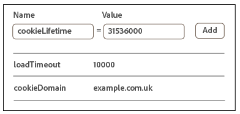

# Implementation with Dynamic Tag Management{#implementation-with-dynamic-tag-management}

古い実装では、Dynamic Tag Management（DTM）を使用して、Experience Cloud IDサービスを設定、デプロイ、および他のExperience Cloudソリューションと統合できます。

## Implementation with Dynamic Tag Management {#topic-6f4ed5d96977406ca991e50f3fbd5b01}

古い実装では、Dynamic Tag Management（DTM）を使用して、Experience Cloud IDサービスを設定、デプロイ、および他のExperience Cloudソリューションと統合できます。

>[!NOTE]
>
>Currently, [Adobe Experience Platform Launch](https://docs.adobelaunch.com/) is the preferred and recommended implementation tool because it helps simplify complex tag management tasks and automates code placement beyond the capabilities of DTM. See [Implement with Launch](../implementation-guides/ecid-implement-with-launch.md).

## Dynamic Tag Management と ID サービス {#section-4a4c4fac5d0a4cbbaff8e1833f73657c}

[Dynamic Tag Management](https://marketing.adobe.com/resources/help/en_US/dtm/) を使用すると、IDサービスインスタンスと関連 [!DNL Experience Cloud] ソリューション統合を設定、デプロイおよび管理できます。DTM を使用すると、ID サービスとその他の Experience Cloud ソリューションが緊密に統合されるため、実装プロセスを簡略化できます。Experience Cloud ID ツールを追加して設定し、以下のような情報を指定するだけです。

* Experience Cloud 組織 ID（Experience Cloud にリンクすると自動的に設定されます）
* Analytics トラッキングサーバー（セキュアおよび非セキュア）
* Experience Cloud サーバー（ファーストパーティのトラッキングサーバーの場合）

すべての [!DNL Experience Cloud] のお客様は、DTM を無料で利用できます。

**DTMファーストステップガイド**

DTM は、シンプルでありながら強力なツールです。まだ使用していないのであれば、使用することを強くお勧めします。このサービスの使用を開始するには、DTM [ドキュメント](https://marketing.adobe.com/resources/help/en_US/dtm/c_overview.html)および [DTM ジャンプスタートビデオ](https://marketing.adobe.com/resources/help/en_US/dtm/jump-start-videos.html)を参照してください。DTM を使用した ID サービスの設定方法の手順については、以下の節の情報および手順を参照してください。

## Deployment guidelines {#concept-54a2ec49af8f4bfca9207b1d404e8e1a}

Dynamic Tag Management（DTM）を使用してExperience Cloud IDサービスを実装する前に、これらの要件および手順を確認してください。

<!--
mcvid-dtm-deployment.xml
-->

**アカウントのプロビジョニング**

Before you can get started, make sure your organization and solutions have been provisioned for the [!DNL Experience Cloud] and you&#39;re familiar with [!DNL Dyanamic Tag Management]. このドキュメントは、操作を開始する際に役立つ情報を提供します。

* [コアサービスのソリューションの有効化](https://marketing.adobe.com/resources/help/en_US/mcloud/core_services.html):Experience Cloudを実装し、管理者になります。このプロセスでは、顧客属性や Experience Cloud オーディエンスなどコアサービスのソリューションを最新化します。
* [Dynamic Tag Management はじめに](https://marketing.adobe.com/resources/help/en_US/dtm/get_started.html)
* [ジャンプスタートビデオ](https://marketing.adobe.com/resources/help/en_US/dtm/jump-start-videos.html):基本的なDTMタスクの実行方法を示す短いビデオのシリーズです。

**IDサービスコードの配置と読み込み順序**

ID サービスは、[!DNL Adobe] データ収集サーバーに一意の ID をリクエストし、受け取ることによって機能します。適切に動作させるには、ID サービスコードを以下のようにする必要があります。

* ページで実行する [!DNL Adobe] コードの最初のブロックである。
* Placed as high on the page as possible, usually within the `<head>` code block.

すべての [!DNL Adobe] ソリューションおよび DTM のコードライブラリを自分で維持している限り、確実に ID サービスコードが適切な場所に配置され、適切なタイミングで実行されます。

**地域データ収集の検証**

Customers must provide a CNAME or use [!DNL *.sc.omtrdc] for [regional data collection](https://marketing.adobe.com/resources/help/en_US/whitepapers/rdc/) (RDC). [!DNL Adobe] コンサルタントから特定のRDC設定を取得します。

**Analyticsレポートスイートの設定**

新規 [!DNL Analytics] ユーザーは、データ収集用の[レポートスイートを作成](https://marketing.adobe.com/resources/help/en_US/reference/new_report_suite.html)する必要があります。

## DTM を使用した Experience Cloud ID サービスの実装 {#task-a659cf19dea84ad48edabe0b72ef9f5c}

Dynamic Tag Management（DTM）を使用して ID サービスを実装するには、以下の手順に従います。

**前提条件**

* [!DNL Experience Cloud] のソリューションを有効にして、管理者権限があることを確認します。See [Enable your solutions for core services](https://marketing.adobe.com/resources/help/en_US/mcloud/core_services.html).

* DTM で Web プロパティを作成します。DTM の [Web プロパティの作成](https://marketing.adobe.com/resources/help/en_US/dtm/web_property.html)ドキュメントや[管理者のジャンプスタートビデオ](https://marketing.adobe.com/resources/help/en_US/dtm/admin-jump-start.html)を参照してください。

<!--
mcvid-dtm-implement.xml
-->

**DTMでIDサービスを実装** するための実装手順:

1. In the DTM [!DNL Dashboard], click the web property you want to work with.
1. In the **[!UICONTROL Overview]** tab of your selected web property, click **[!UICONTROL Add a Tool]**.
1. **[!UICONTROL ツールタイプ]** リストで **[!UICONTROL 、&quot;Experience Cloud IDサービス]**」をクリックします。

   >[!NOTE]
   >
   >This action populates the **[!UICONTROL Experience Cloud Organization ID]** box with your Organization ID. DTM アカウントが [!DNL Experience Cloud] にリンクされていない場合、この ID を指定する必要があります。アカウントをリンクするには、[Experience Cloud でのアカウントのリンク](https://marketing.adobe.com/resources/help/en_US/mcloud/organizations.html)を参照してください。組織 ID を見つける方法については、[要件](../reference/requirements.md#section-a02f537129a64ffbb690d5738d360c26)を参照してください。

1. Type the name of your tracking server in the **[!UICONTROL Tracking Server]** box. If you&#39;re not sure how to find your tracking server see the [FAQ](../faq-intro/faq.md) and [Correctly Populate the trackingServer and trackingServerSecure variables](https://helpx.adobe.com/analytics/kb/determining-data-center.html#).
1. Click **[!UICONTROL Create Tool]** and **[!UICONTROL Save Changes]**.

   保存したら、ID サービスは DTM のツールとして設定されます。ただし、まだ使用する準備は整っていません。DTM ツールは、DTM 公開／承認プロセスを経る必要があり、追加のパラメーターを設定することもできます。DTM 承認プロセスについて詳しくは、[ユーザーの基礎知識ジャンプスタート](https://marketing.adobe.com/resources/help/en_US/dtm/user-basics-jump-start.html)ビデオを参照してください。DTM に追加できるパラメーターについて詳しくは、 [DTM 用の Experience Cloud ID サービス設定](../implementation-guides/standard.md#concept-fb6cb6a0e6cc4f10b92371f8671f6b59).

>[!MORE_ LIKE_ THIS]
>
>* [Web プロパティ](https://marketing.adobe.com/resources/help/en_US/dtm/web_property.html)


## DTM 用の Experience Cloud ID サービス設定 {#concept-fb6cb6a0e6cc4f10b92371f8671f6b59}

Describes the [!DNL Organization ID], [!DNL General] and [!DNL Customer Settings] fields and how they&#39;re used by the [!DNL Experience Cloud] ID service.

<!--
mcvid-dtm-settings.xml
-->

## How do I find these settings? {#section-c5b2d1c928944ae2b8565c1b182fe575}

設定は、ID サービスを Dynamic Tag Management（DTM）のツールとして追加して保存した後で利用できます。You can also access these settings by clicking the gear icon from the [!DNL Installed Tools] section of your DTM web property.


## 組織 ID {#section-949b5a0d8af940558b04ff675cf53f77}

これは、プロビジョニングされた [!DNL Experience Cloud] の会社に必要で、その会社に関連付けられた ID です。組織は、管理者がユーザーおよびグループを設定し、[!DNL Experience Cloud] でのシングルサインオンアクセスを制御することを可能にするエンティティです。組織 ID は、24 文字の英数字から成る文字列で、その後に @AdobeOrg（必須）が続きます。[!DNL Experience Cloud] 管理者は、[Experience Cloud／ツール](https://marketing.adobe.com/resources/help/en_US/mcloud/admin_getting_started.html)でこの ID を見つけることができます。


[cookieとExperience Cloud IDサービス](../introduction/cookies.md)も参照してください。

## General settings {#section-071d358e40f84629a8901b893dd61392}

これらの設定を使用すると、トラッキングサーバーおよびコードバージョンを指定したり、その他の変数を追加したりできます。


The following table lists and defines the [!DNL General] settings.

**訪問者 ID を自動的にリクエスト**

When checked, dynamic tag management to automatically calls the `getMarketingCloudVisitorID()` method before loading any of the Adobe solutions that use the Experience Cloud ID Service.

[getMarketingCloudVisitorID](../library/get-set/getmcvid.md)を参照してください。

**Analytics トラッキングサーバー**

Anatytics のデータ収集に使用されるトラッキングサーバーの名前です。これは、イメージリクエストおよび Cookie が記述されたドメインです（例：[!DNL http://site.omtrdc.net]）。

If you don&#39;t know your tracking server URLs, check your `s_code.js` or `AppMeasurement.js` files. `s.trackingServer` 変数で URL を設定することもできます。

[trackingServer](https://marketing.adobe.com/resources/help/en_US/sc/implement/trackingServer.html) および [Correctly Populate the trackingServer and trackingServerSecure variable](https://helpx.adobe.com/analytics/kb/determining-data-center.html#) を参照してください。

**トラッキングサーバー保護**

Anatytics のデータ収集に使用されるセキュリティで保護されたトラッキングサーバーの名前です。これは、イメージリクエストおよび Cookie が記述されたドメインです（例：[!DNL https://site.omtrdc.net]）。

If you don&#39;t know your tracking server URLs, check your `s_code.js` or `AppMeasurement.js` files. `s.trackingServerSecure` 変数で URL を設定することもできます。

[trackingServer](https://marketing.adobe.com/resources/help/en_US/sc/implement/trackingServer.html) および [Correctly Populate the trackingServer and trackingServerSecure variable](https://helpx.adobe.com/analytics/kb/determining-data-center.html#) を参照してください。

**Experience Cloud サーバー**

ファーストパーティのデータ収集（CNAME）を使用して、サードパーティのコンテキストでファーストパーティ Cookie を利用する場合は、ここにトラッキングサーバー（例：[!DNL http://metrics.company.com]）を入力します。

**Experience Cloud サーバー保護**

ファーストパーティのデータ収集（CNAME）を使用して、サードパーティのコンテキストでファーストパーティ Cookie を利用する場合は、ここにトラッキングサーバー（例：[!DNL https://metrics.company.com]）を入力します。

**ライブラリバージョン**

使用する ID サービスコードライブラリ（`VisitorAPI.js`）のバージョンを設定します。これらのメニューオプションは編集できません。

**設定**

これらのフィールドを使用すると、[関数の変数](../library/function-vars/function-vars.md)をキーと値のペアとして追加できます。「**[!UICONTROL 追加]」をクリックして、1 つまたは複数の変数を ID サービス実装に追加します。**



>[!IMPORTANT]
>
>Set the `cookieDomain` variable here. これは、URL の末尾 2 つのパートのいずれかが 3 文字以上から成るマルチパートのトップレベルドメインの場合に必須です。前述の変数の設定に関するドキュメントのリンクを参照してください。

## 顧客設定 {#section-238d1272c1504d148fe38fb0ae5d71c2}

統合コードまたは認証状態ステータスを追加できる、追加のフィールドです。


**統合コード**

統合コードは、一意の、顧客が提供する ID です。統合コードには、[ で](https://marketing.adobe.com/resources/help/en_US/aam/create-datasource.html)データソースを作成[!DNL Audience Manager]するために使用された値が含まれている必要があります。

**値**

値は、ユーザー ID を含むデータ要素である必要があります。データ要素は、動的な値の格納に適したコンテナです。例えば、クライアント独自の内部システムから取得した ID などを格納できます。

**認証状態**

訪問者の認証状態（ログイン済み、ログアウト済みなど）に従って、訪問者を定義または識別するオプションです。詳しくは、[顧客 ID と認証状態](../reference/authenticated-state.md)を参照してください。

## Test and verify the Experience Cloud ID Service {#concept-644fdbef433b46ba9c0634ac95eaa680}

これらの説明、ツール、手順は、ID サービスが適切に動作しているかどうかを判定するのに役立ちます。これらのテストは、一般に、ID サービスに適用され、様々な ID サービスと [!DNL Experience Cloud] ソリューションの組み合わせに適用されます。

<!--
mcvid-test-verify.xml
-->

## Before you begin {#section-b1e76ad552ed4eb793b6e521a55127d4}

IDサービスのテストと検証を始める前に知っておくべき重要な情報です。

**ブラウザー環境**

通常のブラウザーセッションでテストする場合、各テストの前にブラウザーキャッシュをクリアします。

または、匿名ブラウザーセッションで ID サービスをテストできます。匿名セッションでは、各テストの前に、ブラウザーの Cookie またはキャッシュをクリアする必要はありません。

**ツール**

[Adobe Debugger](https://marketing.adobe.com/resources/help/en_US/sc/implement/debugger.html) および [Charles HTTP プロキシ](https://www.charlesproxy.com/)を使用すると、Analytics を使用して ID サービスが適切に動作するように設定されていることを判定できます。この節の情報は、Adobe Debugger および Charles が返す結果に基づいています。ただし、お客様に最適なツールやデバッガーを自由に使用することができます。

## Adobe Debugger を使用したテスト {#section-861365abc24b498e925b3837ea81d469}

Your service integration is configured properly when you see a [!DNL Experience Cloud ID] (MID) in the [!DNL Adobe] debugger response. See [Cookies and the Experience Cloud ID Service](../introduction/cookies.md) for more information about the MID.

[!DNL Adobe][デバッガを使用してIDサービスのステータスを検証するに](https://marketing.adobe.com/resources/help/en_US/sc/implement/debugger.html)は:

1. ブラウザーの Cookie をクリアするか、匿名ブラウジングセッションを開きます。
1. ID サービスコードを含むテストページを読み込みます。
1. Open the [!DNL Adobe] debugger.
1. MID の結果をチェックします。

## Understanding Adobe Debugger results {#section-bd2caa6643d54d41a476d747b41e7e25}

The MID is stored in a key-value pair that uses this syntax: `MID= *`Experience Cloud ID`*`. デバッガーは、この情報を以下に示すように表示します。

**成功**

以下に示すような応答が表示される場合、ID サービスは適切に実装されています。

```
mid=20265673158980419722735089753036633573
```

[!DNL Analytics] のお客様の場合、MID に加えて [!DNL Analytics] ID（AID）が表示されることがあります。これは、以下の場合に発生します。

* 初期のサイト訪問者または長期滞在しているサイト訪問者がいる場合。
* 猶予期間を有効にしている場合。

**失敗**

デバッガーが以下の動作をする場合は、[カスタマーケア](https://helpx.adobe.com/marketing-cloud/contact-support.html)にお問い合わせください。

* MID を返さない。
* パートナー ID がプロビジョニングされていないことを示すエラーメッセージを返す。

## Testing with the Charles HTTP proxy {#section-d9e91f24984146b2b527fe059d7c9355}

Charles を使用した ID サービスのステータスを検証するには：

1. ブラウザーの Cookie をクリアするか、匿名ブラウジングセッションを開きます。
1. Charles を開始します。
1. ID サービスコードを含むテストページを読み込みます。
1. 以下に説明するリクエストと応答の呼び出しとデータをチェックします。

## Understanding Charles results {#section-c10c3dc0bb9945cbaffcf6fec7082fab}

Charles を使用して HTTP 呼び出しを監視する場合、どこを見て何を探すかに関する情報については、この節を参照してください。

**Charlesでの成功したIDサービスリクエスト**

`Visitor.getInstance` 関数が `dpm.demdex.net` に対する JavaScript 呼び出しをおこなう場合、ID サービスコードは適切に動作しています。成功したリクエストには、[組織 ID](../reference/requirements.md#section-a02f537129a64ffbb690d5738d360c26) が含まれます。The Organization ID is passed as a key-value pair that uses this syntax: `d_orgid= *`organization ID`*`. Look for the `dpm.demdex.net` and the JavaScript calls under the [!DNL Structure] tab. Look for your Organization ID under the [!DNL Request] tab.


**Charlesでの成功したIDサービス応答**

[データ収集サーバー](https://marketing.adobe.com/resources/help/en_US/aam/c_compcollect.html)（DCS）からの応答が MID を返す場合、アカウントは ID サービスに関して適切にプロビジョニングされています。The MID is returned as a key-value pair that uses this syntax: `d_mid: *`visitor Experience Cloud ID`*`. Look for the MID in the [!DNL Response] tab as shown below.


**Charlesでの失敗したIDサービス応答**

DCS 応答に MID がない場合、アカウントは適切にプロビジョニングされています。An unsuccessful response returns an error code and message in the [!DNL Response] tab as shown below. DCS 応答にこのメッセージが表示された場合は、カスタマーケアにお問い合わせください。


エラーコードについて詳しくは、[DCS エラーコード、メッセージおよび例](https://marketing.adobe.com/resources/help/en_US/aam/dcs_error_codes.html)を参照してください。
