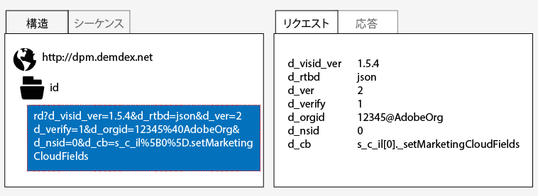
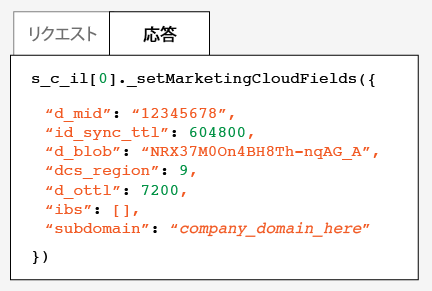
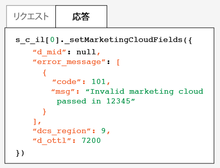

# Adobe Visitor ID サービスのテストと検証{#test-and-verify-the-experience-cloud-id-service}

これらの手順、ツール、手順は、訪問者ID サービスが適切に動作しているかどうかを判断するのに役立ちます。 これらのテストは、一般的に訪問者ID サービスに適用され、様々な訪問者ID サービスとCX エンタープライズソリューションの組み合わせに適用されます。

## 始める前に {#section-b1e76ad552ed4eb793b6e521a55127d4}

Visitor ID サービスのテストと検証を開始する前に知っておくべき重要な情報です。

**ブラウザー環境**

通常のブラウザーセッションでテストする場合、各テストの前にブラウザーキャッシュをクリアします。

または、匿名または匿名のブラウザーセッションで訪問者ID サービスをテストすることもできます。 匿名セッションでは、各テストの前に、ブラウザーの Cookie またはキャッシュをクリアする必要はありません。

**ツール**

[Adobe デバッガー](https://experienceleague.adobe.com/docs/analytics/implementation/validate/debugger.html?lang=ja)と[Charles HTTP プロキシ &#x200B;](https://www.charlesproxy.com/)は、訪問者ID サービスがAnalyticsで正しく動作するように設定されているかどうかを判断するのに役立ちます。 この節の情報は、Adobe Debugger および Charles が返す結果に基づいています。 ただし、お客様に最適なツールやデバッガーを自由に使用することができます。

## Adobe Debugger を使用したテスト {#section-861365abc24b498e925b3837ea81d469}

Adobe デバッガーのレスポンスにECIDが表示される場合、サービス統合が正しく設定されます。 MIDについて詳しくは、[Cookieと訪問者ID サービス &#x200B;](../introduction/cookies.md)を参照してください。

Adobe [debugger](https://experienceleague.adobe.com/docs/analytics/implementation/validate/debugger.html?lang=ja)を使用して訪問者ID サービスのステータスを確認するには：

1. ブラウザーの Cookie をクリアするか、匿名ブラウジングセッションを開きます。
1. 訪問者ID サービスコードを含むテストページを読み込みます。
1. Adobe デバッガーを開きます。
1. MID の結果をチェックします。

## Adobe Debugger の結果について {#section-bd2caa6643d54d41a476d747b41e7e25}

MIDは、この構文を使用するキーと値のペアに格納されます：`MID= *`ECID`*`。 デバッガーは、この情報を以下に示すように表示します。

**成功**

次のような応答が表示された場合、訪問者ID サービスは適切に実装されています。

```
mid=20265673158980419722735089753036633573
```

Analyticsのお客様の場合は、MIDに加えてAnalytics ID （AID）が表示される場合があります。 これは、以下の場合に発生します。

* 初期のサイト訪問者または長期滞在しているサイト訪問者がいる場合。
* 猶予期間を有効にしている場合。

**失敗**

デバッガーが以下の動作をする場合は、[カスタマーケア](https://helpx.adobe.com/jp/marketing-cloud/contact-support.html)にお問い合わせください。

* MID を返さない。
* パートナー ID がプロビジョニングされていないことを示すエラーメッセージを返す。

## Charles HTTP プロキシを使用したテスト {#section-d9e91f24984146b2b527fe059d7c9355}

Charlesで訪問者ID サービスのステータスを確認するには：

1. ブラウザーの Cookie をクリアするか、匿名ブラウジングセッションを開きます。
1. Charles を開始します。
1. 訪問者ID サービスコードを含むテストページを読み込みます。
1. 以下に説明するリクエストと応答の呼び出しとデータをチェックします。

## Charles の結果について {#section-c10c3dc0bb9945cbaffcf6fec7082fab}

Charles を使用して HTTP 呼び出しを監視する場合、どこを見て何を探すかに関する情報については、この節を参照してください。

**チャールズでの訪問者ID サービスのリクエストが正常に完了しました**

`Visitor.getInstance`関数が`dpm.demdex.net`へのJavaScript呼び出しを行うと、訪問者ID サービスコードが正しく機能しています。 リクエストが成功すると、[IMS組織ID](../reference/requirements.md#section-a02f537129a64ffbb690d5738d360c26)が含まれます。 IMS組織IDは、次の構文を使用するキーと値のペアとして渡されます：`d_orgid= *`IMS組織ID`*`。 「[!UICONTROL Structure]」タブで、`dpm.demdex.net` および JavaScript 呼び出しを探します。 [!UICONTROL Request] タブでIMS組織IDを探します。



**チャールズでの訪問者ID サービスの応答が成功しました**

[&#x200B; データ収集サーバー](https://experienceleague.adobe.com/docs/audience-manager/user-guide/reference/system-components/components-data-collection.html?lang=ja) （DCS）からの応答がMIDを返す場合、訪問者ID サービスに対してアカウントが正しくプロビジョニングされました。 MIDは、次の構文を使用するキーと値のペアとして返されます：`d_mid: *`訪問者ECID`*`。 以下に示すように、「[!UICONTROL Response]」タブで、MID を探します。



**チャールズで失敗した訪問者ID サービスの応答**

DCS 応答に MID がない場合、アカウントは適切にプロビジョニングされています。 失敗した応答は、以下に示すように、「[!UICONTROL Response]」タブにエラーコードとメッセージを返します。 DCS 応答にこのエラーメッセージが表示された場合は、カスタマーケアへのお問い合わせ。



エラーコードについて詳しくは、[DCS エラーコード、メッセージおよび例](https://experienceleague.adobe.com/docs/audience-manager/user-guide/api-and-sdk-code/dcs/dcs-api-reference/dcs-error-codes.html?lang=ja)を参照してください。

