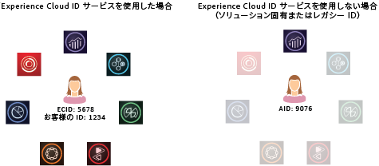

# 訪問者ID サービスについて{#aboutidservice}

Adobe CX EnterpriseのVisitor ID サービスの役割。

<!--
mcvid-functionality.xml
-->

## 訪問者ID サービス：コアサービスの基本要素 {#section-2de0eb1d65664e92a4d8bbb167b84bde}

訪問者ID サービスは、CX エンタープライズ コアサービス、ソリューション、顧客属性およびオーディエンスの共通の識別フレームワークを有効にします。 サイト訪問者に一意の永続的なIDを割り当てることで機能します。 組織が訪問者ID サービスを実装する場合、このIDを使用すると、同じサイト訪問者とそのデータを異なるCX Enterprise ソリューションで識別できます。

また、訪問者ID サービスは、異なるソリューション固有のID （Analytics AIDなど）を置き換えることができます。 また、訪問者ID サービスでは、[顧客IDと認証状態](../reference/authenticated-state.md)機能を通じて、独自の顧客IDをCX Enterpriseに渡すことができます。 ただし、訪問者ID サービスは、既にサブスクライブしているソリューションでのみ動作することに注意してください。 登録していない他の製品には、アクセスできません。

今後、訪問者ID サービスは、現在および将来の多くのCX エンタープライズ機能、機能強化、サービスの不可欠なコンポーネントとなります。 現在、訪問者ID サービスは[Analytics](http://www.adobe.com/jp/marketing-cloud/web-analytics.html)、[Audience Manager](http://www.adobe.com/jp/marketing-cloud/data-management-platform.html)、[Target](http://www.adobe.com/jp/marketing-cloud/testing-targeting.html)をサポートしています。 また、Adobe Device Co-opに参加する場合は必須です。 訪問者ID サービスを実装していない場合は、今から移行戦略の検討を開始します。

## 機能の概要 {#section-96555473455c4bf8924c2d56ff4f3255}

まとめると、訪問者ID サービス：

* プロファイルと ID のリンクに使用できる共通キーまたは ID を作成します。
* 複数のソリューションにわたってデバイスを一意に識別します。
* 同じドメインでトラッキングを確実に行えるように、顧客のドメインにファーストパーティ Cookie を設定します。 [Cookieと訪問者ID サービス ](../introduction/cookies.md)を参照してください。
* CX Enterpriseの顧客およびパートナーからエイリアスとID マッピングを受信します。
* CX Enterprise内のID同期を管理します。
* 広告技術エコシステム全体にわたり様々なサードパーティとの ID 同期をサポートする。

