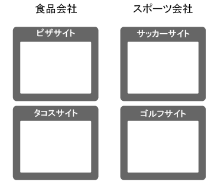
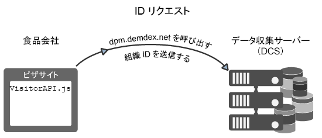
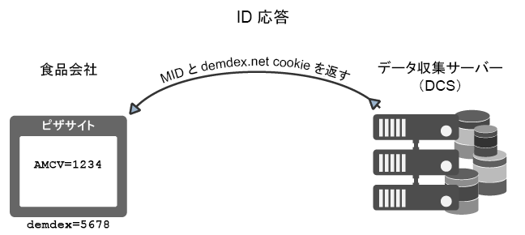
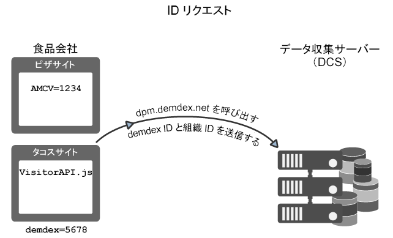
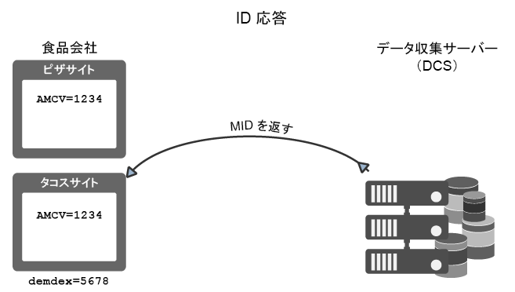
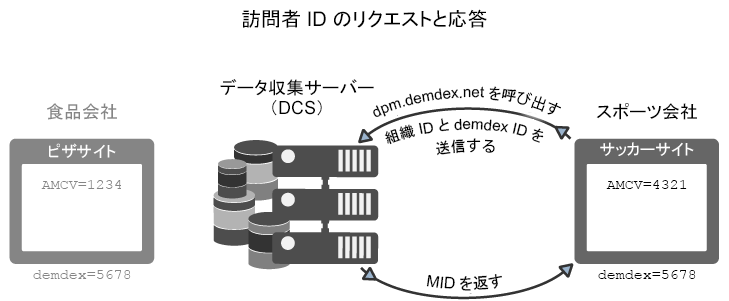

# Experience Cloud Identity Service による ID のリクエスト方法と設定方法{#how-the-experience-cloud-id-service-requests-and-sets-ids}

IDのリクエストと応答のプロセスの概要を示します。 個々のサイト、異なる複数のサイトおよびそれぞれ独自の組織 ID を持つ異なる Experience Cloud ユーザーによって管理されるサイトに対する ID の割り当て例を示しています。

>[!NOTE]
>
>Experience Cloud Identity Service による訪問者 ID の作成方法がわからない場合は、[Experience Cloud](../introduction/cookies.md) を参照してください。

**ヒント：** クロスドメイン追跡に関する [IDサービスのビデオも参照してください](https://helpx.adobe.com/marketing-cloud-core/kb/MCID/CrossDomain.html)。

## Experience Cloud ID のリクエスト {#section-0b5e261fbd0547d9b9a1680e5ce536cc}

以下の例では、ID サービスが Experience Cloud 訪問者 ID をリクエストして受け取る方法を示します。これらの例では、「食品会社」と「スポーツ会社」という 2 つの架空の会社を使用して、ID のリクエストと応答のデータフローを示しています。各会社には一意のExperience Cloud組織IDが割り当てられ、すべてのサイトにIDサービスコードが実装されています。 これらの使用例は、AnalyticsやレガシーIDを使用しない、汎用のIDサービス実装のデータフロー、またはサードパーティcookieをブロックするブラウザーを表しています。

**最初のリクエスト**

この例では、「食べ物」会社で管理されているピザサイトに新しい訪問者がアクセスします。 「食品会社」のピザWebサイトにはIDサービスコードがあります。 ピザサイトが読み込まれると、IDサービスコードは、pizzaドメイン内のAMCV cookieを確認します。

* AMCV cookieが設定されている場合、サイト訪問者にはExperience Cloud IDが割り当てられます。 この場合、その ID を使用して訪問者を追跡し、他の Experience Cloud ソリューションとデータを共有することになります。
* AMCV cookieが設定されていない場合、IDサービスコードは、にある地域 [データ収集サーバー](https://docs.adobe.com/content/help/en/analytics/technotes/rdc/regional-data-collection.html) (DCS)を呼び出します(Demdexドメイン `dpm.demdex.net/id` の呼び出しについても参照 )。 この呼び出しには、「食品会社」の組織 ID が含まれます。この組織 ID は、ID サービスコードの `Visitor.getInstance` 関数に設定されます。

**最初の応答**

応答では、DCS が [!DNL Experience Cloud] ID（MID）と demdex Cookie を返します。IDサービスコードは、AMCV cookieにMID値を書き込みます。 例えば、DCSが1234というMID値を返すとします。 この値が AMCV Cookie に `mid|1234` として保存され、ファーストパーティの pizza ドメインに設定されます。demdex cookieにも一意のIDが含まれます（5678と呼びます）。 このcookieは、pizzaドメインとは別の、サードパーティのdemdex.netドメインに設定されます。

次の例で示すように、訪問者が「食べ物」会社に属する別のサイトに移動した場合、IDサービスはdemdex IDと組織IDを使用して正しいMIDを作成して返すことができます。

## クロスサイトのリクエストと応答 {#section-15ea880453af467abd2874b8b4ed6ee9}

この例では、「食品会社」訪問者は、ピザサイトからタコスサイトに移動します。 食品会社のタコスWebサイトにIDサービスコードがあります。 訪問者はタコスのWebサイトに行ったことがありません。

このような条件の場合、タコスサイトにAMCV cookieが存在しません。 また、IDサービスは、ピザサイトに設定されたAMCV cookieを使用できません。これは、このcookieがpizzaドメインに固有のものであるためです。 その結果、IDサービスはDCSを呼び出して、訪問者IDを確認してリクエストする必要があります。 この場合、DCS呼び出しには、食品会社の組織ID *とdemdex* IDが含まれます。 また、demdex IDはpizzaサイトから取得され、demdex.netドメインの下でサードパーティcookieとして保存されます。

DCSが組織IDとdemdex IDを受け取った後、サイト訪問者の正しいMIDを作成して返します。 この MID は組織 ID と demdex ID から計算されるので、AMCV Cookie には `mid = 1234` という MID 値が含まれます。

## 他のサイトからの ID のリクエスト {#section-ba9a929e50d64b0aba080630fd83b6f1}

この例では、訪問者は「食べ物会社」のサイトを離れ、「スポーツ会社」が所有するサッカーサイトに移動します。 訪問者がサッカーサイトに来ると、IDチェックとリクエストの処理は、前の例で説明したとおりに行います。 ただし、Sports会社には独自の組織IDがあるので、IDサービスは別のMIDを返します。 新しい MID は「スポーツ会社」が管理するドメインに固有のものであり、この MID によってこの会社が [!DNL Experience Cloud] の複数のソリューションで訪問者データを追跡して共有することができます。demdex ID は、サードパーティ Cookie に保存されており、異なるドメインで維持されるので、この訪問者に対して同じものになります。

