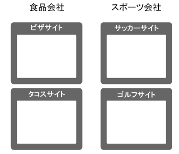
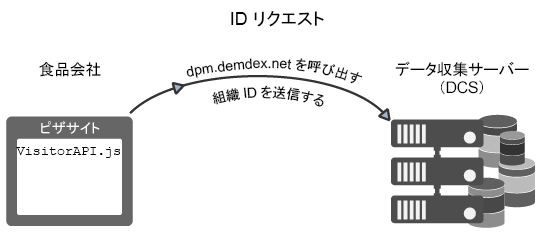
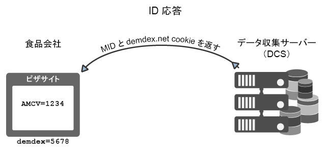
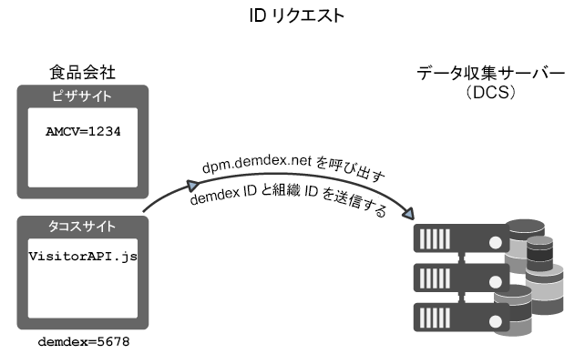
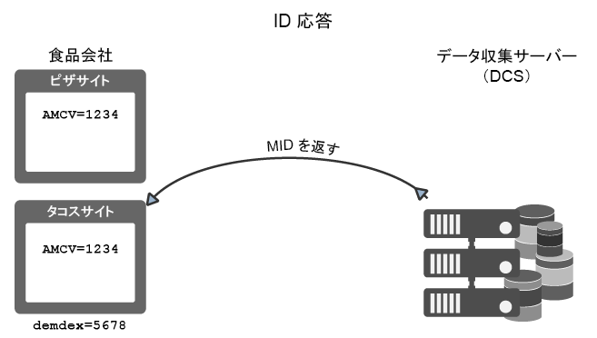
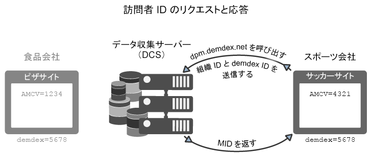

# Adobe Visitor ID サービスがIDをリクエストおよび設定する方法{#how-the-experience-cloud-id-service-requests-and-sets-ids}

ID のリクエストと応答のプロセスについて、概要を説明します。 これらの例では、個々のサイト、異なるサイト、および独自のIMS組織IDを持つ異なるCX Enterprise顧客が管理するサイトのID割り当てについて説明します。

>[!NOTE]
>
>訪問者ID サービスが訪問者IDを作成する方法に慣れていない場合は、少し時間をかけて[Cookieと訪問者ID サービス ](../introduction/cookies.md)を確認してください。

## ECIDのリクエスト {#section-0b5e261fbd0547d9b9a1680e5ce536cc}

次の例は、訪問者ID サービスがECIDをリクエストおよび受信する方法を示しています。 これらの例では、「食品会社」と「スポーツ会社」という 2 つの架空の会社を使用して、ID のリクエストと応答のデータフローを示しています。 各企業は一意のIMS組織IDを持ち、すべてのサイトに訪問者ID サービスコードを実装しています。 これらのユースケースは、Analytics、レガシーID、サードパーティ Cookieをブロックするブラウザーを使用しない、汎用的な訪問者ID サービス実装のデータフローを表します。

**最初のリクエスト**

この例では、「食品会社」が管理するピザサイトに新しい訪問者がアクセスします。 食品会社は、ピザのweb サイトに訪問者ID サービスコードを掲載しています。 ピザサイトが読み込まれると、訪問者ID サービスコードがピザドメインのAMCV Cookieをチェックします。

* AMCV Cookieが設定されている場合、サイト訪問者にはECIDが設定されます。 この場合、Cookieは訪問者を追跡し、他のCX Enterprise ソリューションとデータを共有します。
* AMCV Cookieが設定されていない場合、訪問者ID サービスコードは`dpm.demdex.net/id`の地域[ データ収集サーバー](https://experienceleague.adobe.com/docs/analytics/technotes/rdc/regional-data-collection.html?lang=ja) （DCS）を呼び出します（[Demdex ドメインへの呼び出しについて](https://experienceleague.adobe.com/docs/audience-manager/user-guide/reference/demdex-calls.html?lang=ja)も参照）。 この呼び出しには、食品会社のIMS組織IDが含まれます。 IMS組織IDは、訪問者ID サービスコードの`Visitor.getInstance`関数で設定されます。

**最初の応答**

応答では、DCSはECIDとdemdex Cookieを返します。 訪問者ID サービスコードは、MID値をAMCV Cookieに書き込みます。 例えば、DCS が 1234 という MID 値を返す場合、 この値が AMCV Cookie に `mid|1234` として保存され、ファーストパーティの pizza ドメインに設定されます。 demdex Cookie にも固有の ID があります（5678 とします）。 この Cookie は、pizza ドメインとは異なる、サードパーティの demdex.net ドメインに設定されます。

次の例で示すように、demdex IDとIMS組織IDを使用すると、訪問者が食品会社に属する別のサイトに移動したときに、訪問者ID サービスが正しいMIDを作成して返すことができます。

## クロスサイトのリクエストと応答 {#section-15ea880453af467abd2874b8b4ed6ee9}

この例では、「食品会社」の訪問者は、ピザサイトからタコスサイトに移動します。 食品会社は、タコスのweb サイトに訪問者ID サービスコードがあります。 この訪問者が過去にタコス Web サイトにアクセスしたことはありません。

この条件下では、タコスサイトに AMCV Cookie が存在しません。 また、訪問者ID サービスは、ピザドメインに固有であるため、ピザサイトで設定されたAMCV Cookieを使用できません。 そのため、訪問者ID サービスはDCSを呼び出して、訪問者IDを確認して要求する必要があります。 この場合、DCS呼び出しには、食品会社のIMS組織ID *と*&#x200B;のdemdex IDが含まれます。 また、前述のとおり、demdex ID は pizza サイトから取得され、demdex.net ドメイン下でサードパーティ Cookie として保存されます。

DCSがIMS組織IDとdemdex IDを受け取ると、サイト訪問者に対して正しいMIDが作成され、返されます。 MIDはIMS組織IDとdemdex IDから数学的に派生するため、AMCV cookieにはMID値`mid = 1234`が含まれます。

## 他のサイトからの ID のリクエスト {#section-ba9a929e50d64b0aba080630fd83b6f1}

この例では、訪問者は「食品会社」のサイトを離れ、「スポーツ会社」が所有するサッカーサイトに移動します。 訪問者がサッカーサイトにアクセスしたときの ID チェックとリクエストの処理は、前の例で説明したとおりに実行されます。 ただし、スポーツ会社には独自のIMS組織IDがあるため、訪問者ID サービスは別のMIDを返します。 新しいMIDは、スポーツ企業が管理するドメインに固有であり、CX Enterpriseのソリューション間で訪問者データを追跡および共有できます。 demdex ID は、サードパーティ Cookie に保存されており、異なるドメインで維持されるので、この訪問者に対して同じものになります。

