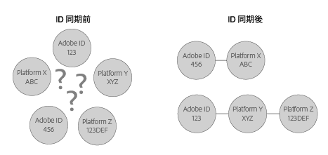

# ID 同期と一致率について {#understanding-id-synchronization-and-match-rates}

Adobe Media Manager および ID サービスを含む、ID 同期プロセスと Experience Cloud Identity Service の一致率の概要です。

## ID 同期と一致率 {#section-f652aae7234945e89d26dd833c5215fb}

ID 同期では、ID サービスによって割り当てられた ID を、顧客によってサイト訪問者に割り当てられた ID と照合します。例えば、ID サービスが訪問者 ID 1234 を割り当てたとします。別のプラットフォームでは、この訪問者を ID 4321 として把握しています。ID サービスは、同期プロセスの間、これらの ID を一緒にマッピングします。その結果、サイト訪問者について顧客が把握する新しいデータポイントが追加されます。そして、ID サービスが ID を照合できない場合、新しい ID が作成され、その ID が将来の同期に使用されます。

一致率は、ID 同期プロセスの有効性を測定および検証します。高い一致率は、特定のサービスが、低い一致率のサービスに比べて、より効率的であり、より多くのオンラインオーディエンスへのアクセスを提供することを示します。一致率の比較は、様々な統合広告技術プラットフォームを評価するための定量化可能な方法です。

**高い一致率の確保**

高い一致率を生成するには、ID サービスを適切に設定することが重要です（[標準実装ガイド](../implementation-guides/standard.md#concept-89cd0199a9634fc48644f2d61e3d2445)を参照）。適切な実装をおこなうことで、使用可能なデータパラメーターを持つ ID を機能させ、同期させるために必要な Cookie を ID サービスが設定できるので、高い一致率を確保できます。ただし、低速なインターネット接続、モバイルデバイスやワイヤレスネットワークからのデータ接続などの要因が、ID サービスによる ID の収集、同期および一致の程度に影響する可能性があります。これらのクライアント側変数は、ID サービスや [!DNL Adobe] では制御できません。

## ID 同期プロセスの説明 {#section-a541a85cbbc74f5682824b1a2ee2a657}

ID サービスは、リアルタイムに ID を同期します。このプロセスは、サーバーからサーバーへのデータ転送を使用する代わりに、ブラウザーで動作します。次の表に、ID 同期プロセスの手順を示します。

**手順 1：ページの読み込み**

訪問者がサイトにアクセスしてページを読み込むと、`Visitor.getInstance` 関数は ID サービスへの [CORS](../reference/cors.md#concept-6c280446990d46d88ba9da15d2dcc758) または JSON-P 呼び出しをおこないます。ID サービスは、訪問者の [!DNL Experience Cloud] ID（MID）を含む Cookie を使用して応答します。MID は、各サイト訪問者に割り当てられた一意の ID です。詳しくは、[Cookie と Experience Cloud Identity Service](../introduction/cookies.md) を参照してください。

**手順 2：iFrame の読み込み**

ページ本文が読み込まれる間、ID サービスは、*`Destination Publishing iFrame`* を調整する際に便利です。[!UICONTROL ターゲットパブリッシング iFrame] は、親ページとは別のドメインに読み込まれます。この設計によって iFrame は以下の動作をするので、ページパフォーマンスを確保し、セキュリティを強化できます。

* 親ページに対して非同期で読み込みます。これは、親ページを[!UICONTROL ターゲットパブリッシング iFrame] とは独立して読み込めることを意味します。iFrame の読み込みと iFrame 内からの ID 同期ピクセルの読み込みは、親ページやユーザーエクスペリエンスには影響しません。
* 可能な限り高速に読み込みます。これが速すぎる場合、ウィンドウ読み込みイベントの後で iFrame を読み込むことができます（非推奨）。詳細は、[idSyncAttachIframeOnWindowLoad](../library/function-vars/idsyncattachiframeonwindowload.md#reference-b86b7112e0814a4c82c4e24c158508f4) を参照してください。
* iFrame のコードが親ページのアクセス権を取得したり、親ページに影響を与えたりすることを防ぎます。

[Experience Cloud Identity Service による ID のリクエスト方法と設定方法](../introduction/id-request.md#concept-2caacebb1d244402816760e9b8bcef6a)も参照してください。

**手順3：ID 同期の実行**

ID 同期は、ターゲットパブリッシング iFrame で実行される URL です。この一般的な例で示すように、ID 同期 URL には、パートナーの ID 同期エンドポイントと、その ID を含む [!DNL Adobe] に戻るリダイレクト URL が含まれます。

`http://abc.com?partner_id=abc&sync_id=123&redir=http://dpm.demdex.net/ibs:dpid=<ADOBE_PARTNER_ID>&dpuuid=<PARTNER_UUID>`

[受信データ転送のための ID 同期](https://experienceleague.adobe.com/docs/audience-manager/user-guide/implementation-integration-guides/sending-audience-data/batch-data-transfer-process/id-sync-http.html?lang=en)も参照してください。

**手順 4：ID の格納**

同期した ID は、[エッジおよびコアデータサーバー](https://experienceleague.adobe.com/docs/audience-manager/user-guide/reference/system-components/components-edge.html?lang=en)に格納されます。

## ID 同期を管理する同期サービス {#section-cd5784d7ad404a24aa28ad4816a0119a}

*`Sync Services`* という用語は、ID 同期を担当する内部 Experience Cloud [!DNL Experience Cloud]テクノロジーのことを指します。このサービスは、デフォルトで有効になっています。無効にするには、[オプションの変数 ](../library/function-vars/disableidsync.md#reference-589d6b489ac64eddb5a7ff758945e414) を ID サービス `Visitor.getInstance` 関数に追加します。同期サービスは、以下のような様々な [!DNL Experience Cloud] ID を一致させます。

* サードパーティ [!DNL Experience Cloud] Cookie ID とファーストパーティ [!DNL Experience Cloud] ID。

* ファーストパーティ [!DNL Experience Cloud] Cookie ID と [!DNL Adobe Media Optimizer]（AMO）ID。

* サードパーティ [!DNL Experience Cloud] Cookie ID とサードパーティデータプロバイダーおよびターゲットプラットフォーム ID。これには、データプロバイダー、デマンドサイドプラットフォームおよびサプライサイドプラットフォーム、アドネットワーク、アドエクスチェンジなどのサービスおよびプラットフォームが含まれます。
* ファーストパーティ [!DNL Experience Cloud] Cookie ID とクロスデバイスパートナー ID。

## Adobe Advertising Cloud との ID 同期 {#section-642c885ea65d45ffb761f78838735016}

[!DNL Adobe Media Optimizer]（以前の [!DNL Adobe Advertising Cloud]）、iFrame ベースの ID 同期プロセスの例外です。[!DNL Advertising Cloud] は信頼されているドメインなので、ID 同期は [!UICONTROL Destination Publishing iFrame] 内ではなく親ページからおこなわれます。同期中、ID サービスは `cm.eversttech.net` の [!DNL Advertising Cloud] を呼び出します。cm.eversttech.net はアドビが [!DNL Advertising Cloud]Media Manager を買収する以前に使用されていた従来のドメイン名です。[!DNL Advertising Cloud] にデータを送信すると一致率の向上に役立ちます。バージョン 2.0 以降を使用している ID サービスのお客様の場合、このデータ送信は自動的におこなわれます。[Advertising Cloud Cookies](https://experienceleague.adobe.com/docs/core-services/interface/administration/ec-cookies/cookies-advertising-cloud.html?lang=en) も参照してください。

>[!MORELIKETHIS]
>
>* [demdex ドメインの呼び出しについて](https://experienceleague.adobe.com/docs/audience-manager/user-guide/reference/demdex-calls.html?lang=en)

