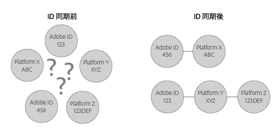

# ID 同期と一致率について{#understanding-id-synchronization-and-match-rates}

Adobe Media Optimizerや訪問者ID サービスを含む、訪問者ID サービスでのID同期プロセスと一致率の概要。

## ID 同期と一致率 {#section-f652aae7234945e89d26dd833c5215fb}

IDの同期は、訪問者ID サービスによって割り当てられたIDと、顧客によってサイト訪問者に割り当てられたIDと一致します。 例えば、訪問者ID サービスが訪問者ID 1234を割り当てたとします。 別のプラットフォームでは、この訪問者を ID 4321 として把握しています。 訪問者ID サービスは、同期プロセス中にこれらのIDをマッピングします。 その結果、サイト訪問者について顧客が把握する新しいデータポイントが追加されます。 また、訪問者ID サービスがIDと一致しない場合は、新しいIDを作成し、そのIDを将来の同期に使用します。

一致率は、ID 同期プロセスの有効性を測定および検証します。 高い一致率は、特定のサービスが、低い一致率のサービスに比べて、より効率的であり、より多くのオンラインオーディエンスへのアクセスを提供することを示します。 一致率の比較は、様々な統合広告技術プラットフォームを評価するための定量化可能な方法です。

**高い一致率の確保**

適切な実装を行うと、訪問者ID サービスが機能するために必要なCookieを設定し、有効なデータパートナーとIDを同期できるため、高い一致率を確保できます。 ただし、インターネット接続の遅さ、モバイルデバイスまたはワイヤレスネットワークからのデータ収集などの要因は、訪問者ID サービスがIDを収集、同期、および照合する方法に影響を与える可能性があります。 これらのクライアントサイド変数は、Visitor ID サービスまたはAdobeの制御を超えています。

## ID 同期プロセスの説明 {#section-a541a85cbbc74f5682824b1a2ee2a657}

訪問者ID サービスは、IDをリアルタイムで同期します。 このプロセスは、サーバーからサーバーへのデータ転送を使用する代わりに、ブラウザーで動作します。 次の表に、ID 同期プロセスの手順を示します。

**手順 1：ページの読み込み**

訪問者がサイトにアクセスしてページを読み込むと、`Visitor.getInstance`関数は[CORS](../reference/cors.md#concept-6c280446990d46d88ba9da15d2dcc758)またはJSON-P呼び出しを訪問者ID サービスに行います。 訪問者ID サービスは、訪問者のECIDを含むCookieで応答します。 MID は、各サイト訪問者に割り当てられた一意の ID です。 [Cookieと訪問者ID サービス ](../introduction/cookies.md)も参照してください。

**手順 2：iFrame の読み込み**

ページ本文の読み込み中に、訪問者ID サービスは&#x200B;*`Destination Publishing iFrame`*&#x200B;というiFrameを読み込みます。 [!UICONTROL Destination Publishing iFrame] は、親ページとは別のドメインに読み込まれます。 この設計によって iFrame は以下の動作をするので、ページパフォーマンスを確保し、セキュリティを強化できます。

* 親ページに対して非同期で読み込みます。 これは、親ページを [!UICONTROL Destination Publishing iFrame] とは独立して読み込めることを意味します。 iFrame の読み込みと iFrame 内からの ID 同期ピクセルの読み込みは、親ページやユーザーエクスペリエンスには影響しません。
* 可能な限り高速に読み込みます。 これが速すぎる場合、ウィンドウ読み込みイベントの後で iFrame を読み込むことができます（非推奨）。 詳細は、[idSyncAttachIframeOnWindowLoad](../library/function-vars/idsyncattachiframeonwindowload.md#reference-b86b7112e0814a4c82c4e24c158508f4) を参照してください。
* iFrame のコードが親ページのアクセス権を取得したり、親ページに影響を与えたりすることを防ぎます。

[訪問者ID サービスがIDを要求および設定する方法…](../introduction/id-request.md#concept-2caacebb1d244402816760e9b8bcef6a)も参照してください。

**手順3：ID 同期の実行**

ID 同期は、ターゲットパブリッシング iFrame で実行される URL です。 この汎用的な例に示すように、ID同期URLには、パートナーのID同期エンドポイントと、IDを含むAdobeへのリダイレクトであるリダイレクト URLが含まれます。

`http://abc.com?partner_id=abc&sync_id=123&redir=http://dpm.demdex.net/ibs:dpid=<ADOBE_PARTNER_ID>&dpuuid=<PARTNER_UUID>`

[受信データ転送のための ID 同期](https://experienceleague.adobe.com/docs/audience-manager/user-guide/implementation-integration-guides/sending-audience-data/batch-data-transfer-process/id-sync-http.html?lang=ja)も参照してください。

**手順 4：ID の格納**

同期した ID は、[エッジおよびコアデータサーバー](https://experienceleague.adobe.com/docs/audience-manager/user-guide/reference/system-components/components-edge.html?lang=ja)に格納されます。

## ID 同期を管理する同期サービス {#section-cd5784d7ad404a24aa28ad4816a0119a}

*`Sync Services`*&#x200B;という用語は、IDの同期を担当する社内のCX Enterprise テクノロジを指します。 このサービスは、デフォルトで有効になっています。 これを無効にするには、訪問者ID サービス `Visitor.getInstance`関数に[ オプション変数](../library/function-vars/disableidsync.md#reference-589d6b489ac64eddb5a7ff758945e414)を追加します。 Sync Servicesは、次のような異なるECIDに一致します。

* サードパーティのECIDからファーストパーティのECIDへのエンタープライズ Cookie。

* ファーストパーティ CX エンタープライズ Cookie IDからAdobe Media Optimizer （AMO） ID。

* サードパーティのデータプロバイダーやターゲティングプラットフォーム IDに接続するサードパーティのCX エンタープライズ Cookie ID。 これには、データプロバイダー、デマンドサイドプラットフォームおよびサプライサイドプラットフォーム、アドネットワーク、アドエクスチェンジなどのサービスおよびプラットフォームが含まれます。
* ファーストパーティ CX エンタープライズ Cookie IDからクロスデバイスパートナーID。

## Adobe Advertising Cloud との ID 同期 {#section-642c885ea65d45ffb761f78838735016}

Adobe Advertising Cloud （旧Adobe Media Optimizer）は、iFrame ベースのID同期プロセスの例外です。 Advertising Cloudは信頼できるドメインであるため、IDの同期は[!UICONTROL Destination Publishing iFrame]ではなく親ページから行われます。 同期中、Visitor ID サービスは`cm.eversttech.net`でAdvertising Cloudを呼び出します。これは、Adobeが買収する前にAdvertising Cloudで使用されていたレガシードメイン名です。 Advertising Cloudにデータを送信すると、一致率が向上し、バージョン 2.0以降を使用しているVisitor ID Serviceのお客様に対して自動的に送信されます。 [Advertising Cloud Cookies](https://experienceleague.adobe.com/docs/core-services/interface/administration/ec-cookies/cookies-advertising-cloud.html?lang=ja) も参照してください。

>[!MORELIKETHIS]
>
>* [demdex ドメインの呼び出しについて](https://experienceleague.adobe.com/docs/audience-manager/user-guide/reference/demdex-calls.html?lang=ja)

