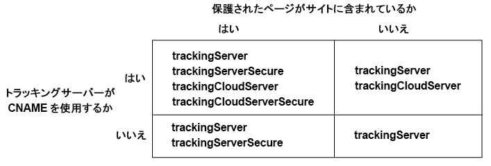

# Experience Cloud ID サービスの Analytics への実装 {#implement-the-experience-cloud-id-service-for-analytics}

これらの手順は、Experience Cloud ID サービスを使用し、Dynamic Tag Management（DTM）を使用しない Analytics のお客様向けです。ただし、ID サービスの実装に DTM を使用することを強くお勧めします。DTM は、実装ワークフローを合理化し、適切なコード配置と優先順位付けを自動的に確認します。

>[!IMPORTANT]
>
>* [始める前に、要件を確認してください](../mcvid-reference/mcvid-requirements.md)。
>* このコードを本番環境に実装する前に、開発環境で設定してテストしてください。
>


Adobe Analytics用にIDサービスを実装するには、次の手順に従います。

1. [IDサービスコードのダウンロード](../mcvid-implementation-guides/mcvid-setup-analytics.md#section-ead9403a6b7e45b887f9ac959ef89f7f)
1. [IDサービスコードへのVisitor. getInstance関数の追加](../mcvid-implementation-guides/mcvid-setup-analytics.md#section-6053a6b7c16c466a9f9fdbf9cb9db3df)
1. [Visitor. getInstanceにExperience Cloud組織IDを追加します](../mcvid-implementation-guides/mcvid-setup-analytics.md#section-7b8a6e76dc124d0e9ab1ce96ab2ffb0e)
1. [Visitor. getInstanceにトラッキングサーバーを追加します](../mcvid-implementation-guides/mcvid-setup-analytics.md#section-70ec9ebff47940d8ab520be5ec4728c5)
1. [AppMeasurement. jsまたはs_ code. jsファイルの更新](../mcvid-implementation-guides/mcvid-setup-analytics.md#section-b53113aea1bd4de896e0e4e9a7edee19)
1. [ページへの訪問者APIコードの追加](../mcvid-implementation-guides/mcvid-setup-analytics.md#section-d46d6aa324c842f2931d901e38d6db1d)
1. [（オプション）猶予期間の設定](../mcvid-implementation-guides/mcvid-setup-analytics.md#section-7bbb2f72c26e4abeb8881e18366797a3)
1. [IDサービスコードのテストと導入](../mcvid-implementation-guides/mcvid-setup-analytics.md#section-e9c1764ac21a4ec5be1ff338c0e2e01b)

## 手順1:IDサービスコードのダウンロード {#section-ead9403a6b7e45b887f9ac959ef89f7f}

コードライブラリが [!DNL ID Service]`VisitorAPI.js` 必要です。このコードライブラリをダウンロードするには：

1. **[!UICONTROL 管理]** 者/ **[!UICONTROL コードマネージャー]** に移動します。
1. In [!DNL Code Manager], click either **[!UICONTROL JavaScript (New)]** or **[!UICONTROL JavaScript (Legacy)]**.

   圧縮されたコードライブラリがダウンロードされます。

1. コードファイルを解凍し、`VisitorAPI.js` ファイルを開きます。

## 手順 2：IDサービスコードへのVisitor. getInstance関数の追加 {#section-6053a6b7c16c466a9f9fdbf9cb9db3df}

>[!IMPORTANT]
>
>* ID サービス API の過去のバージョンでは、この関数を別の場所に別の構文で配置する必要がありました。[version 1.4](../mcvid-release-notes/mcvid-notes-2015.md#section-f5c596f355b14da28f45c798df513572) より前のバージョンから移行する場合は、ここで説明する新しい場所と構文について注意してください。
>* すべて大文字で書かれたコードは、実際の値のプレースホルダーです。このテキストを組織 ID、トラッキングサーバー URL、またはその他の指定された値に置き換えます。
>


**パート 1：以下の Visitor.getInstance 関数をコピーします**

```js
var visitor = Visitor.getInstance("INSERT-MARKETING-CLOUD-ORGANIZATION-ID-HERE", { 
     trackingServer: "INSERT-TRACKING-SERVER-HERE", // same as s.trackingServer 
     trackingServerSecure: "INSERT-SECURE-TRACKING-SERVER-HERE", // same as s.trackingServerSecure 
 
     // To enable CNAME support, add the following configuration variables 
     // If you are not using CNAME, DO NOT include these variables 
     marketingCloudServer: "INSERT-TRACKING-SERVER-HERE", 
     marketingCloudServerSecure: "INSERT-SECURE-TRACKING-SERVER-HERE" // same as s.trackingServerSecure 
}); 
```

**パート 2：VisitorAPI.js ファイルに関数コードを追加します**

`Visitor.getInstance` 関数をファイル末尾のコードブロックの後に配置します。編集後のファイルは以下のようになります。

```js
/* 
========== DO NOT ALTER ANYTHING BELOW THIS LINE ========== 
Version and copyright section 
*/ 
 
// Visitor API code library section 
 
// Put Visitor.getInstance at the end of the file, after the code library

var visitor = Visitor.getInstance("INSERT-MARKETING-CLOUD-ORGANIZATION-ID-HERE", { 
     trackingServer: "INSERT-TRACKING-SERVER-HERE", // same as s.trackingServer 
     trackingServerSecure: "INSERT-SECURE-TRACKING-SERVER-HERE", // same as s.trackingServerSecure 
 
     // To enable CNAME support, add the following configuration variables 
     // If you are not using CNAME, DO NOT include these variables 
     marketingCloudServer: "INSERT-TRACKING-SERVER-HERE", 
     marketingCloudServerSecure: "INSERT-SECURE-TRACKING-SERVER-HERE" // same as s.trackingServerSecure 
}); 
```

## 手順3:Visitor. getInstanceにExperience Cloud組織IDを追加します {#section-7b8a6e76dc124d0e9ab1ce96ab2ffb0e}

`Visitor.getInstance` 関数で、組織ID `INSERT-MARKETING-CLOUD-ORGANIZATION ID-HERE` に置き換え [!DNL Experience Cloud] ます。組織 ID がわからない場合、[!DNL Experience Cloud] 管理ページで確認できます。[管理 - コアサービス](https://marketing.adobe.com/resources/help/en_US/mcloud/admin_getting_started.html)も参照してください。編集後の関数は、以下のサンプルのようになります。

`var visitor = Visitor.getInstance("1234567ABC@AdobeOrg", { ...`

>[!IMPORTANT]
>
>*組織ID内の文字の大文字小文字は* 変更しないでください。この ID は大文字小文字が区別され、割り当てられたとおりに使用する必要があります。

## 手順4:Visitor. getInstanceにトラッキングサーバーを追加します {#section-70ec9ebff47940d8ab520be5ec4728c5}

トラッキングサーバーは、[!DNL Analytics] データ収集に使用されます。

**パート 1：トラッキングサーバー URL の確認**

トラッキング `s_code.js` サーバーURLを確認するには `AppMeasurement.js` 、またはファイルを確認してください。この URL に以下の変数を指定します。

* `s.trackingServer`
* `s.trackingServerSecure`

**パート 2：トラッキングサーバー変数の設定**

使用するトラッキングサーバー変数を判断するには：

1. 以下の判断マトリックスの質問に答えます。自分の答えに合う変数を使用します。
1. トラッキングサーバーのプレースホルダーをトラッキングサーバー URL に置き換えます。
1. 未使用のトラッキングサーバーおよび [!DNL Experience Cloud] サーバーの変数をコードから削除します。



>[!NOTE]
>
>使用する場合、 [!DNL Experience Cloud] サーバーURLは次のような対応するトラッキングサーバーURLに一致します。&gt;
>* [!DNL Experience Cloud] server URL=トラッキングサーバーURL
>* [!DNL Experience Cloud] server secure URL=トラッキングサーバーセキュアURL
>


トラッキングサーバーを確認する方法が不明な場合は、 [FAQ](../mcvid-faq-intro/mcvid-faq.md) および [trackingServer変数およびtrackingServerSecure変数の適切な設定](https://helpx.adobe.com/analytics/kb/determining-data-center.html#)を参照してください。

## 手順5:AppMeasurement. jsまたはs_ code. jsファイルの更新 {#section-b53113aea1bd4de896e0e4e9a7edee19}

この関数をまたはファイルに追加 `AppMeasurement.js``s_code.js` します。

`s.visitor = Visitor.getInstance("INSERT-MARKETING-CLOUD-ORGANIZATION ID-HERE");`

同じセクションに、 `linkInternalFilters`など `charSet`の設定を含むコードを配置 `trackDownloads`します。

**（オプション、推奨）**カスタム prop の作成**

範囲に `AppMeasurement.js` カスタムpropを設定したり `s_code.js` 、有効範囲を測定したりします。このカスタムpropを、お客様 `doPlugins``AppMeasurement.js` または `s_code.js` ファイルの関数に追加します。

```js
// prop1 is used as an example only. Choose any available prop. 
s.prop1 = (typeof(Visitor) != "undefined" ? "VisitorAPI Present" : "VisitorAPI Missing");
```

## 手順6:ページへの訪問者APIコードの追加 {#section-d46d6aa324c842f2931d901e38d6db1d}

各ページのタグ内に `VisitorAPI.js` ファイル `<head>` を配置します。`VisitorAPI.js` ファイルをページに配置する際には、以下のようにします。

* 他のソリューションタグの前に `<head>` セクションの先頭に配置します。
* AppMeasurement およびその他の [!DNL Experience Cloud] ソリューションのコードより前に実行する必要があります。

テストと検証の後にこのコードを本番に移行します。

## 手順7:（オプション）猶予期間の設定 {#section-7bbb2f72c26e4abeb8881e18366797a3}

これらの使用例のいずれかが状況に該当する場合は、 [カスタマーケア](https://helpx.adobe.com/marketing-cloud/contact-support.html) に問い合わせて一時 [的な猶予期間](../mcvid-reference/mcvid-analytics-reference/mcvid-grace-period.md)を設定してください。猶予期間は最大 180 日間有効です。必要に応じて、猶予期間を更新できます。

**部分的実装**

ID サービスを使用するページと使用しないページが混在し、そのすべてのページが同じ [!DNL Analytics] レポートスイートで管理される場合は、猶予期間が必要です。この状況は、複数のドメインで管理されるグローバルなレポートスイートがある場合に一般的です。

同じレポートスイートで管理されるすべての Web ページに ID サービスを導入した後に、猶予期間を停止します。

**s_vi Cookie の要件**

新しい訪問者が ID サービスへの移行後に s_vi Cookie を使用する必要がある場合、猶予期間が必要です。この状況は、実装で s_vi Cookie を読み取って変数に保存している場合に一般的です。

実装で s_vi Cookie を読み取る代わりに MID を取得できるようになった後に、猶予期間を停止します。

[cookieとExperience Cloud IDサービス](../mcvid-introduction/mcvid-cookies.md)を参照してください。

クリックストリームデータフィードから内部システムにデータを送信していて、そのプロセスで `visid_high` 列と `visid_low` 列を使用している場合、猶予期間が必要です。

データ収集プロセスでおよび `post_visid_high``post_visid_low` 列を使用できるようになった後、猶予期間を停止します。

[クリックストリームデータ列リファレンス](https://marketing.adobe.com/resources/help/en_US/sc/clickstream/datafeeds_reference.html)を参照してください。

**クリックストリームデータ収集**

## 手順8:IDサービスコードのテストと導入 {#section-e9c1764ac21a4ec5be1ff338c0e2e01b}

次のようにテストおよびデプロイできます。

**テストと確認**

ID サービスの導入状況をテストするには、以下の項目を確認します。

* [AMCV cookie](../mcvid-introduction/mcvid-cookies.md)（ページがホストされているドメイン内）
* [!DNL Analytics] イメージリクエストの MID 値（[Adobe Debugger ツール](https://marketing.adobe.com/resources/help/en_US/sc/implement/debugger.html)を使用）

詳しくは、Experience Cloud IDサービスの [テストと検証](../mcvid-implementation-guides/mcvid-test-verify.md)を参照してください。

**コードの導入**

テストの合格後に、コードを導入します。

[手順 7](../mcvid-implementation-guides/mcvid-setup-analytics.md#section-7bbb2f72c26e4abeb8881e18366797a3) で猶予期間を有効にした場合：

* [!DNL Analytics] ID（AID）と MID がイメージリクエストに含まれていることを確認します。
* 停止条件が満たされたら、必ず猶予期間を無効にします。
