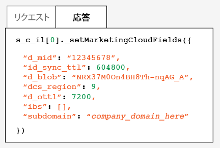
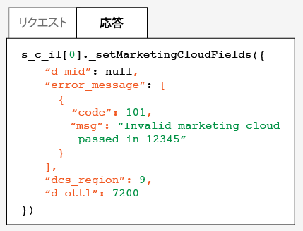

# Experience Cloud ID サービスのテストと検証 {#test-and-verify-the-experience-cloud-id-service}

これらの説明、ツール、手順は、ID サービスが適切に動作しているかどうかを判定するのに役立ちます。これらのテストは、一般に、ID サービスに適用され、様々な ID サービスと Experience Cloud ソリューションの組み合わせに適用されます。

## 始める前に{#section-b1e76ad552ed4eb793b6e521a55127d4}

ID サービスのテストと検証を始める前に知っておくべき重要な情報です。

**ブラウザー環境**

通常のブラウザーセッションでテストする場合、各テストの前にブラウザーキャッシュをクリアします。

または、匿名ブラウザーセッションで ID サービスをテストできます。匿名セッションでは、各テストの前に、ブラウザーの Cookie またはキャッシュをクリアする必要はありません。

**ツール**

[Adobe Debugger](https://marketing.adobe.com/resources/help/ja_JP/sc/implement/debugger.html) および [Charles HTTP プロキシ](https://www.charlesproxy.com/) は、Analyticsで ID サービスが正しく動作するように設定されているかどうかを判断するのに役立ちます。この節の情報は、Adobe Debugger および Charles が返す結果に基づいています。ただし、お客様に最適なツールやデバッガーを自由に使用することができます。

## Adobe Debugger を使用したテスト{#section-861365abc24b498e925b3837ea81d469}

[!DNL Adobe] Debugger の応答に [!DNL Experience Cloud ID]（MID）が表示される場合、サービス統合は適切に設定されています。[Cookie と Experience Cloud ID サービス](../mcvid-introduction/mcvid-cookies.md)を参照してください。

[!DNL Adobe] [デバッガー](https://marketing.adobe.com/resources/help/ja_JP/sc/implement/debugger.html)を使用して ID サービスのステータスを検証するには：

1. ブラウザーの Cookie をクリアするか、匿名ブラウジングセッションを開きます。
1. ID サービスコードを含むテストページを読み込みます。
1. [!DNL Adobe] Debugger を開きます。
1. MID の結果をチェックします。

## Adobe Debugger の結果について {#section-bd2caa6643d54d41a476d747b41e7e25}

MID は、キーと値のペアで格納されます（`MID= *`Experience Cloud ID`*` という構文が使用されます）。デバッガーは、この情報を以下に示すように表示します。

**成功**

以下に示すような応答が表示される場合、ID サービスは適切に実装されています。

```
mid=20265673158980419722735089753036633573
```

[!DNL Analytics] のお客様の場合、MID に加えて [!DNL Analytics] ID（AID）が表示されることがあります。これは、以下の場合に発生します。

* 初期のサイト訪問者または長期滞在しているサイト訪問者がいる場合。
* 猶予期間を有効にしている場合。

**失敗**

デバッガーが以下の動作をする場合は、[カスタマーケア](https://helpx.adobe.com/jp/marketing-cloud/contact-support.html)にお問い合わせください。

* MID を返さない。
* パートナー ID がプロビジョニングされていないことを示すエラーメッセージを返す。

## Charles HTTP プロキシを使用したテスト {#section-d9e91f24984146b2b527fe059d7c9355}

Charles を使用した ID サービスのステータスを検証するには：

1. ブラウザーの Cookie をクリアするか、匿名ブラウジングセッションを開きます。
1. Charles を開始します。
1. ID サービスコードを含むテストページを読み込みます。
1. 以下に説明するリクエストと応答の呼び出しとデータをチェックします。

## Charles の結果について {#section-c10c3dc0bb9945cbaffcf6fec7082fab}

Charles を使用して HTTP 呼び出しを監視する場合、どこを見て何を探すかに関する情報については、この節を参照してください。

**Charles での成功した ID サービスリクエスト**

`Visitor.getInstance` 関数が `dpm.demdex.net` に対する JavaScript 呼び出しをおこなう場合、ID サービスコードは適切に動作しています。成功したリクエストには、[組織 ID](../mcvid-reference/mcvid-requirements.md#section-a02f537129a64ffbb690d5738d360c26) が含まれます。組織 ID は、キーと値のペアとして渡されます（`d_orgid= *`組織 ID`*` という構文が使用されます）。「[!DNL Structure]」タブで、`dpm.demdex.net` および JavaScript 呼び出しを探します。「[!DNL Request]」タブで、組織 ID を探します。


**Charles での成功した ID サービス応答**

[データ収集サーバー](https://marketing.adobe.com/resources/help/ja_JP/aam/c_compcollect.html)（DCS）からの応答が MID を返す場合、アカウントは ID サービスに関して適切にプロビジョニングされています。MID は、キーと値のペアとして返されます（`d_mid: *`訪問者の Experience Cloud ID`*` という構文が使用されます）。以下に示すように、「[!DNL Response]」タブで、MID を探します。



**Charles での失敗した ID サービス応答**

DCS 応答に MID がない場合、アカウントは適切にプロビジョニングされています。失敗した応答は、以下に示すように、「[!DNL Response]」タブにエラーコードとメッセージを返します。DCS 応答にこのメッセージが表示された場合は、カスタマーケアにお問い合わせください。



エラーコードについて詳しくは、[DCS エラー コード、メッセージ、および例](https://marketing.adobe.com/resources/help/ja_JP/aam/dcs_error_codes.html)を参照してください。
