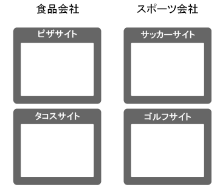
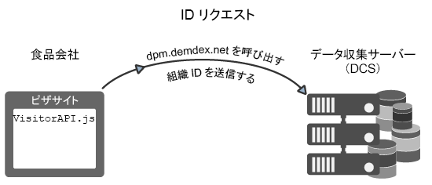
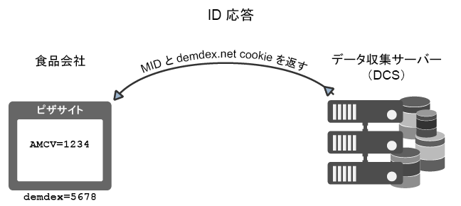
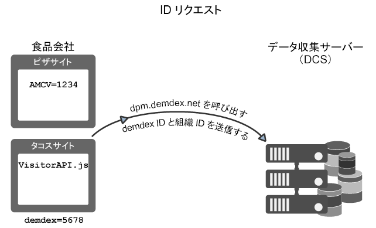
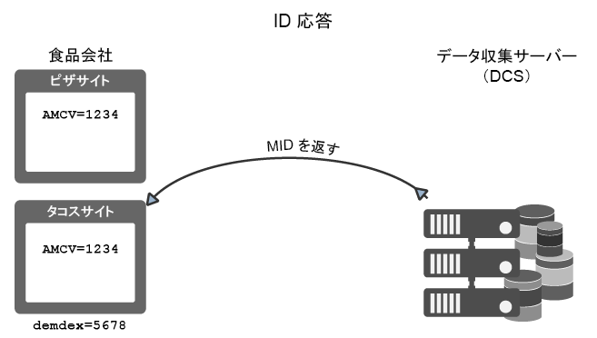
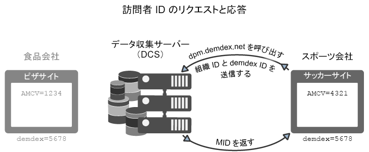

# Experience Cloud IDサービスのリクエストとIDの設定方法{#how-the-experience-cloud-id-service-requests-and-sets-ids}

ID のリクエストと応答のプロセスについて、概要を説明します。個々のサイト、異なる複数のサイトおよびそれぞれ独自の組織 ID を持つ異なる Experience Cloud ユーザーによって管理されるサイトに対する ID の割り当て例を示しています。

>[!NOTE]
>
>Experience Cloud IDサービスが訪問者IDをどのように作成するかに精通していない場合は [、&quot;Experience Cloud](../mcvid-introduction/mcvid-cookies.md)」を確認してください。

**ヒント：**[クロスドメイントラッキングに関する ID サービスのビデオ](https://helpx.adobe.com/marketing-cloud-core/kb/MCID/CrossDomain.html)も参照してください。

## Experience Cloud ID のリクエスト {#section-0b5e261fbd0547d9b9a1680e5ce536cc}

以下の例では、ID サービスが Experience Cloud 訪問者 ID をリクエストして受け取る方法を示します。これらの例では、「食品会社」と「スポーツ会社」という2つの架空の会社を使用して、IDリクエストと回答のデータフローを示します。それぞれの会社には固有の Experience Cloud 組織 ID が割り当てられ、すべてのサイトに ID サービスコードが実装されています。これらの使用例では、Analytics や従来の ID を使用せず、サードパーティ Cookie をブロックするブラウザーも使用しない一般的な ID サービス実装のデータフローを表しています。

**最初のリクエスト**

この例では、「食品会社」が管理するピザサイトに新しい訪問者がアクセスします。「食品会社」のこのピザ Web サイトには ID サービスコードが含まれています。ピザサイトが読み込まれるときに、この ID サービスコードは、pizza ドメインの AMCV Cookie があるかをチェックします。

* AMCV Cookie が設定されている場合、そのサイトの訪問者には Experience Cloud ID が割り当てられています。この場合、cookieは訪問者を追跡し、他のExperience Cloudソリューションとデータを共有します。
* AMCV Cookie が設定されていない場合、ID サービスコードは、[ にある地域別](https://marketing.adobe.com/resources/help/en_US/aam/?f=c_compcollect.html)データ収集サーバー`dpm.demdex.net/id`（DCS）を呼び出します（[Demdex ドメインの呼び出しについて](https://marketing.adobe.com/resources/help/en_US/aam/demdex-calls.html)も参照してください）。この呼び出しには、「食品会社」の組織 ID が含まれます。この組織 ID は、ID サービスコードの `Visitor.getInstance` 関数に設定されます。

**最初の応答**

応答では、DCS が [!DNL Experience Cloud] ID（MID）と demdex Cookie を返します。ID サービスコードが AMCV Cookie に MID 値を書き込みます。例えば、DCS が 1234 という MID 値を返す場合、この値が AMCV Cookie に `mid|1234` として保存され、ファーストパーティの pizza ドメインに設定されます。demdex Cookie にも固有の ID があります（5678 とします）。この Cookie は、pizza ドメインとは異なる、サードパーティの demdex.net ドメインに設定されます。

以下の例で示すとおり、訪問者が「食品会社」に属する別のサイトに移動すると、ID サービスは demdex ID と組織 ID を使用して正しい MID を作成して返すことができます。

## クロスサイトリクエストと応答 {#section-15ea880453af467abd2874b8b4ed6ee9}

この例では、「食品会社」の訪問者は、ピザサイトからタコスサイトに移動します。「食品会社」のこのタコス Web サイトには ID サービスコードが含まれています。この訪問者が過去にタコス Web サイトにアクセスしたことはありません。

この条件下では、タコスサイトに AMCV Cookie が存在しません。また、ID サービスは、ピザサイトに設定されている AMCV Cookie を使用できません。この Cookie は pizza ドメインに固有のものであるからです。そのため、ID サービスは DCS を呼び出して、訪問者 ID を確認してリクエストする必要があります。この場合、DCS の呼び出しには、「食品会社」の組織 ID に加えて demdex ID も含まれます。**また、前述のとおり、demdex ID は pizza サイトから取得され、demdex.net ドメイン下でサードパーティ Cookie として保存されます。

DCS が組織 ID と demdex ID を受け取った後、サイト訪問者の正しい MID を作成して返します。この は組織 ID と demdex ID から計算されるので、AMCV Cookie には `mid = 1234`mid =   という MID 値が含まれます。

## 他のサイトからのIDリクエスト {#section-ba9a929e50d64b0aba080630fd83b6f1}

この例では、訪問者は「食品会社」のサイトを離れ、「スポーツ会社」が所有するサッカーサイトに移動します。訪問者がサッカーサイトにアクセスしたときの ID チェックとリクエストの処理は、前の例で説明したとおりに実行されます。ただし、「スポーツ会社」には独自の組織 ID があるので、ID サービスが返す MID は異なります。新しい MID は「スポーツ会社」が管理するドメインに固有のものであり、この MID によってこの会社が [!DNL Experience Cloud] の複数のソリューションで訪問者データを追跡して共有することができます。demdex ID は、サードパーティ Cookie に保存されており、異なるドメインで維持されるので、この訪問者に対して同じものになります。

