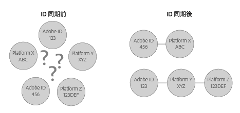

# ID同期と一致率について{#understanding-id-synchronization-and-match-rates}

Adobe Media Manager および ID サービスを含む、ID 同期プロセスと Experience Cloud ID サービスの一致率の概要です。

## ID同期と一致率 {#section-f652aae7234945e89d26dd833c5215fb}

ID 同期は、ID サービスによって割り当てられた ID を顧客によってサイト訪問者に割り当てられた ID に一致させます。例えば、ID サービスが訪問者 ID 1234 を割り当てたとします。別のプラットフォームでは、この訪問者を ID 4321 として把握しています。ID サービスは、同期プロセスの間、これらの ID を一緒にマッピングします。その結果、サイト訪問者について顧客が把握する新しいデータポイントが追加されます。そして、ID サービスが ID を一致させることができない場合、新しい ID が作成され、その ID が将来の同期に使用されます。

一致率は、ID 同期プロセスの有効性を測定および検証します。高い一致率は、特定のサービスが、低い一致率のサービスに比べて、より効率的であり、より多くのオンラインオーディエンスへのアクセスを提供することを示します。一致率の比較は、様々な統合広告技術プラットフォームを評価するための定量化可能な方法です。



**高い一致率の確保**

高い一致率を生成するには、IDサービスを適切に設定することが重要です（ [標準導入ガイド](../mcvid-implementation-guides/mcvid-standard.md#concept-89cd0199a9634fc48644f2d61e3d2445)を参照）。適切な実装により、使用可能なデータパラメーターを持つ ID を機能させ、同期させるために必要な Cookie を ID サービスが設定できるので、高い一致率を確保できます。ただし、低速なインターネット接続、モバイルデバイスやワイヤレスネットワークからのデータ接続などの要因が、ID サービスによる ID の収集、同期および一致の程度に影響する可能性があります。これらのクライアント側変数は、ID サービスや [!DNL Adobe] では制御できません。

## ID同期プロセスの説明 {#section-a541a85cbbc74f5682824b1a2ee2a657}

ID サービスは、リアルタイムに ID を同期します。このプロセスは、サーバーからサーバーへのデータ転送を使用する代わりに、ブラウザーで動作します。以下の表で、ID 同期プロセスの手順を説明します。

**手順1:ロードページ**

訪問者がサイトに来訪してページをロードすると、 `Visitor.getInstance` そのIDサービスに [CORS](../mcvid-reference/mcvid-cors.md#concept-6c280446990d46d88ba9da15d2dcc758) またはJSON- P呼び出しが行われます。ID サービスは、訪問者の [!DNL Experience Cloud] ID（MID）を含む Cookie を使用して応答します。MID は、各サイト訪問者に割り当てられた一意の ID です。また、 [Cookie と Experience Cloud ID サービス](../mcvid-introduction/mcvid-cookies.md).

**手順 2：iFrame の読み込み**

ページ本文が読み込まれる間、ID サービスは、 *`Destination Publishing iFrame`*. 親ページとは別にドメインに [!DNL Destination Publishing iFrame] 読み込まれます。この設計によって iFrame は以下の動作をするので、ページパフォーマンスを確保し、セキュリティを強化できます。

* 親ページとは非同期で読み込みます。つまり、親ページは、その親ページから独立してロード [!DNL Destination Publishing iFrame]できます。iFrame の読み込みと iFrame 内からの ID 同期ピクセルの読み込みは、親ページやユーザーエクスペリエンスには影響しません。
* 可能な限り高速に読み込みます。これが速すぎる場合、ウィンドウ読み込みイベントの後で iFrame を読み込むことができます（非推奨）。詳しくは、[idSyncAttachIframeOnWindowLoad](../mcvid-library/mcvid-function-vars/mcvid-idsyncattachiframeonwindowload.md#reference-b86b7112e0814a4c82c4e24c158508f4) を参照してください。
* iFrame のコードが親ページのアクセス権を取得したり、親ページに影響を与えたりすることを防ぎます。

また、 [Experience Cloud ID サービスによる ID のリクエスト方法と設定方法...](../mcvid-introduction/mcvid-id-request.md#concept-2caacebb1d244402816760e9b8bcef6a).

**手順3：ID 同期の実行**

ID 同期は、ターゲットパブリッシング iFrame で実行される URL です。この一般的な例で示すように、ID 同期 URL には、パートナーの ID 同期エンドポイントと、その ID を含む [!DNL Adobe] に戻るリダイレクト URL が含まれます。

```
http://abc.com?partner_id=abc&sync_id=123&redir=http://dpm.demdex.net/ibs:dpid=<
<varname>
  ADOBE_PARTNER_ID
</varname>>&dpuuid=<
<varname>
  PARTNER_UUID
</varname>>
```

[受信データ転送のための ID 同期](https://marketing.adobe.com/resources/help/en_US/aam/c_id_sync_in.html)も参照してください。

**手順 4：ID の格納**

同期した ID は、[エッジおよびコアデータサーバー](https://marketing.adobe.com/resources/help/en_US/aam/c_compedge.html)に格納されます。

## 同期サービスはID同期を管理します {#section-cd5784d7ad404a24aa28ad4816a0119a}

この用語 *`Sync Services`* は、ID同期を担当する内部 [!DNL Experience Cloud] テクノロジーを指します。このサービスは、デフォルトで有効になっています。無効にするには、[オプションの変数](../mcvid-library/mcvid-function-vars/mcvid-disableidsync.md#reference-589d6b489ac64eddb5a7ff758945e414)を ID サービスの `Visitor.getInstance` 関数に追加します。同期サービスは、次のような異なる [!DNL Experience Cloud] IDに一致します。

* サードパーティ [!DNL Experience Cloud] cookie IDに対するファーストパーティ [!DNL Experience Cloud] ID。

* ファーストパーティ [!DNL Experience Cloud] cookie ID（ [!DNL Adobe Media Optimizer] AMO） ID。

* サードパーティ [!DNL Experience Cloud] Cookie ID とサードパーティデータプロバイダーおよびターゲットプラットフォーム ID。これには、データプロバイダー、デマンドサイドプラットフォームおよびサプライサイドプラットフォーム、アドネットワーク、アドエクスチェンジなどのサービスおよびプラットフォームが含まれます。
* ファーストパーティ [!DNL Experience Cloud] cookie ID（クロスデバイスパートナーID）。

## Adobe Media OptimizerとのID同期 {#section-642c885ea65d45ffb761f78838735016}

[!DNL Adobe Media Optimizer] は、iFrameベースのID同期プロセスの例外です。信頼されたドメインなので [!DNL Media Optimizer] 、ID同期は、内部ではなく親ページから実行さ [!DNL Destination Publishing iFrame]れます。同期中、IDサービスは [!DNL Media Optimizer] 、 `cm.eversttech.net`アドビにより獲得の前に使用される従来 [!DNL Media Optimizer] のドメイン名である、at.データを送信 [!DNL Media Optimizer] して一致率を改善し、バージョン2.0（以上）を使用するIDサービスのお客様に自動的に対応。[Media Manager の cookie](https://marketing.adobe.com/resources/help/en_US/whitepapers/cookies/cookies_media_optimizer.html) も参照してください。

>[!MORE_ LIKE_ THIS]
>
>* [demdex ドメインの呼び出しについて](https://marketing.adobe.com/resources/help/en_US/aam/demdex-calls.html)

