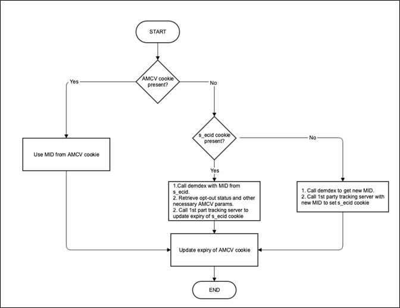

# Safari ITP での ECID ライブラリの手法

>[!NOTE]
>
>2020 年 11 月 12 日（PT）に Big Sur OS リリースの一環としてリリースされた ITP に対する最新の変更を反映するため、アップデートがおこなわれました。

Safari は ITP を使用したクロスドメイントラッキングと強く結びついているので、アドビでは、お客様および消費者のプライバシーおよび選択肢をサポートするライブラリのベストプラクティスを維持する必要があります。

2020年11月10日現在、document.cookie APIを介して設定されたすべてのファーストパーティの永続的なCookie （クライアント側のCookie）と、Safariおよびモバイル iOSのブラウザーでファーストパーティ CNAME実装を介して設定されるCookieは、有効期限が7日に制限されています。 サードパーティ Cookie は、ITP の以前のバージョンで記載されているように、引き続きブロックされます。 ITP 2.1 およびアドビソリューションへの影響について詳しくは、[Safari ITP 2.1 が Adobe Experience Cloud および Experience Platform のお客様に与える影響](https://medium.com/adobetech/safari-itp-2-1-impact-on-adobe-experience-cloud-customers-9439cecb55ac)を参照してください。

## ITP 関連の変更、方法および設定

Safari 内でのトラッキングのための追加の方法が作成されたら、リファレンスとしてこのページに追加されます。

>[!NOTE]
>
>以下のすべてのドキュメントでは、*ECID*、*MID*、*MCID* は同じです。

ITP および ECID ライブラリの使用に関する取り組みについては、以下を参照してください。

## ITP および Apple の WebKit に関する現在の ECID ライブラリの動作

ITP 2.1 は、クライアント側 Cookie の書き込み機能を阻止し、正確な訪問者トラッキング情報をお客様に提供する機能を低下させます。 そのため、訪問者の Experience Cloud ID（ECID）をファーストパーティ Cookie に格納するという変更が、アドビの CNAME トラッキングサーバーに導入されています。

この変更は、ファーストパーティのコンテキストで Analytics CNAME を使用している ECID お客様にのみ役立ちます。 Analytics のお客様で現在 CNAME を使用していない場合や Analytics のお客様でない場合でも、CNAME レコードが適しています。 カスタマーケアまたは担当のアカウント担当者に問い合わせて、[CNAME](https://experienceleague.adobe.com/docs/core-services/interface/ec-cookies/cookies-first-party.html?lang=ja) の登録プロセスを開始してください。

ECID ライブラリ vにアップグレードします。 4.3.0+を使用して、この変更を活用します。

ITP 2.1 を使用した ECID ライブラリの動作と、Big Sur のリリースの一環として Apple がおこなった最新の変更について、以下の概要を説明します。

**デザイン**

demdex.net に対して ID リクエストがおこなわれ、ECID が取得されると、ECID ライブラリでトラッキングサーバーが設定されている場合、お客様のドメインに対して ID リクエストがおこなわれます。 このエンドポイントは、クエリ文字列から ecid パラメーターを読み取り、ECID および今後の 2 年間の有効期限のみから成る新しい [Cookie](/help/introduction/cookies.md) を設定します。 この方法でこのエンドポイントが呼び出されるたびに、`s_ecid` Cookie は、呼び出されたときから 2 年間の有効期限に書き換えられます。 ECID ライブラリは、この Cookie の値が取得できるように、v 4.3.0 に更新される必要があります。

>[!IMPORTANT]
>
>Big Sur のアップデートの一環として、CNAME を介して設定された `s_ecid` Cookie も 7 日間の有効期限に保持されます。

この新しい `s_ecid` Cookie は、AMCV Cookie と同じオプトアウトステータスに従います。 ecid が `s_ecid` Cookie から読み取られる場合、常に demdex が即座に呼び出されて、その ID の最新のオプトアウトステータスが取得され、AMCV Cookie に格納されます。

さらに、消費者がこの[方法](https://experienceleague.adobe.com/docs/analytics/implementation/js/opt-out.html?lang=ja)を使用して Analytics トラッキングをオプトアウトした場合、この `s_ecid` Cookie は削除されます。

`trackingServer` または `trackingServerSecure` を使用してライブラリを初期化する際に、トラッキングサーバー名が VisitorJS ライブラリに提供される必要があります。 これは、Analytics 設定の`trackingServer` 設定に一致する必要があります。

この方法を利用しないことを選択する場合、次の設定を ECID ライブラリ実装に追加します：`discardtrackingServerECID` この設定が true に設定されている場合、訪問者ライブラリは、ファーストパーティトラッキングサーバーによって設定された MID を読み込みません。

## クロスドメイントラッキング（自社内の複数のドメイン）用の appendVisitorIDsTo メソッドの使用

この関数を使用すると、ブラウザーでサードパーティ Cookie がブロックされている場合でも、複数のドメインにまたがって訪問者の ECID を共有できます。 この関数を使用するには、ID サービスを実装し、ソースドメインおよび宛先ドメインを所有している必要があります。 VisitorAPI.js バージョン 1.7.0 以降（ただし、バージョン 1.10.0 を除く）で利用できます。

**デザイン**

* 訪問者が自社の他のドメインを閲覧すると、Visitor.appendVisitorIDsTo(url) は、クエリパラメーターとして追加された ECID を含む URL を返します。

  この URL を使用して、元のドメインから宛先ドメインにリダイレクトします。

* アドビに訪問者の ID のリクエストを送信するのではなく、宛先ドメインの ID サービスコードによって、URL から ECID が抽出されます。

  このリクエストにはサードパーティ Cookie が含まれますが、この場合、サードパーティ Cookie を利用できません。

* 宛先ページの ID サービスコードは、ECID で渡された値を使用して訪問者を追跡します。

  >[!NOTE]
  >宛先ページが既に以前の訪問での ECID を持っている場合、既存の Cookie を上書きする決定がこの設定 overwriteCrossDomainMCIDAndAID によって制御されます。 この設定について詳しくは、[overwriteCrossDomainMCIDAndAID](/help/library/function-vars/overwrite-visitor-id.md) を参照してください。
  >
  >このメソッドについて詳しくは、[appendVisitorIDsTo（クロスドメイントラッキング）](/help/library/get-set/appendvisitorid.md)リファレンスページを参照してください。

